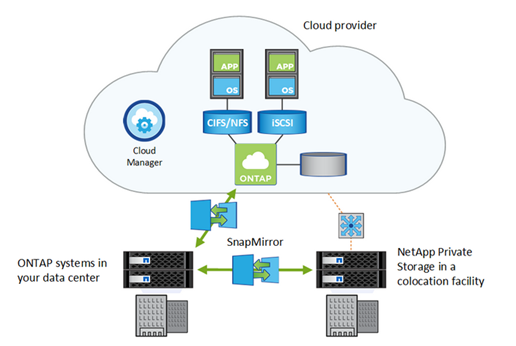

= Replicación de datos
:allow-uri-read: 
:icons: font
:imagesdir: ../media/

[role="lead"]
La tecnología SnapMirror mantiene sus datos sincronizados entre las instalaciones locales y el cloud con copias Snapshot de ONTAP. SnapMirror realiza transferencias de datos incrementales a nivel de bloque para garantizar que solo se envían a la réplica de destino los datos modificados.

De igual modo, puede utilizar una relación de almacén de SnapMirror para crear un archivo de datos para las copias Snapshot locales creadas en un sistema Cloud Volumes ONTAP.

Cloud Backup de NetApp ofrece funcionalidades de backup y restauración sencillas y rentables para proteger y archivar los datos en almacenamiento de objetos en el cloud. Cloud Backup está disponible para los datos basados en cloud y para los datos en las instalaciones.

.Información relacionada
https://tv.netapp.com/detail/video/6056551157001/setup-a-disaster-recovery-copy-with-in-the-cloud-with-netapp-cloud-volumes-ontap?autoStart=true&page=1&q=ontap%20cloud["Configurar una recuperación ante desastres en el cloud con Cloud Volumes ONTAP"]

https://cloud.netapp.com/blog/simplified-disaster-recovery-ontap-cloud-snapmirror["Replicación de datos eficiente mediante Cloud Volumes ONTAP y SnapMirror"]

link:../data-protection/index.html["Protección de datos de ONTAP con la interfaz de línea de comandos"]

https://cloud.netapp.com/cloud-backup-service["Backup en cloud de NetApp"]
