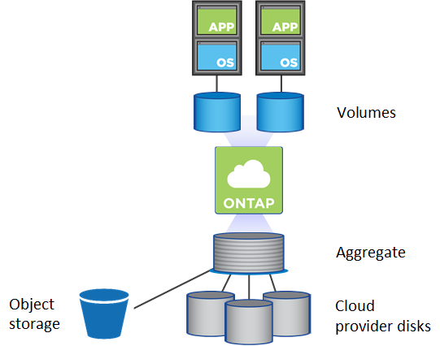

= Gestión de volúmenes
:allow-uri-read: 
:icons: font
:imagesdir: ../media/

[role="lead"]
La gestión de volúmenes flexible y eficiente es el centro de la solución cloud de ONTAP. Los volúmenes de ONTAP FlexVol ofrecen las mismas ventajas de Data Fabric, con los mismos procesos de gestión de datos, independientemente de si están configurados en las instalaciones en el cloud. También puede aprovechar las funcionalidades del cloud para escalar con rapidez cargas de trabajo, aumentando o reduciendo la capacidad según las necesidades.

Los volúmenes de cloud proporcionan las mismas eficiencias de almacenamiento que los volúmenes en las instalaciones: Deduplicación, compresión, compactación, thin provisioning y organización en niveles de los datos. En un entorno de cloud, esto implica que paga menos por el uso subyacente del disco en el cloud.

Existen dos formas de aprovisionar volúmenes en el cloud:

* Cree nuevos volúmenes en el cloud.
* Replicar volúmenes existentes en las instalaciones en un nuevo destino de volúmenes de cloud mediante la tecnología SnapMirror o el servicio Cloud Sync.

.Información relacionada
https://docs.netapp.com/us-en/occm/task_provisioning_storage.html["BlueXP: Aprovisionamiento de almacenamiento"]

https://docs.netapp.com/us-en/occm/task_manage_anf.html["Gestionar volúmenes para Azure NetApp Files"]

https://docs.netapp.com/us-en/occm/task_manage_cvs_aws.html["Gestionar Cloud Volumes Service para AWS"]

https://cloud.netapp.com/cloud-sync-service["Servicio Cloud Sync"]
