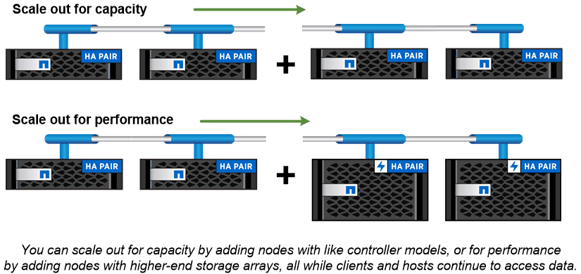

= Almacenamiento en clúster
:allow-uri-read: 
:icons: font
:imagesdir: ../media/

[role="lead"]
La iteración actual de ONTAP se desarrolló originalmente para la arquitectura de almacenamiento Scale Out _cluster_ de NetApp. Es la arquitectura que se suele encontrar en las implementaciones de centros de datos de ONTAP. Dado que esta implementación ejerce la mayoría de las funcionalidades de ONTAP, es un buen lugar para empezar a comprender los conceptos que informan la tecnología ONTAP.

Las arquitecturas de centros de datos suelen poner en marcha controladoras FAS o AFF dedicadas que ejecutan el software para la gestión de datos de ONTAP. Cada controladora, su almacenamiento, su conectividad de red y la instancia de ONTAP que se ejecuta en la controladora se denominan _nodo_

Los nodos están emparejados para alta disponibilidad (ha). La combinación de estos pares (hasta 12 nodos para SAN y un máximo de 24 nodos para NAS) abarca el clúster. Los nodos se comunican entre sí a través de una interconexión de clúster dedicada y privada.

Según el modelo de controladora, el almacenamiento de nodos consta de discos flash, unidades de capacidad o ambos. Los puertos de red de la controladora proporcionan acceso a los datos. Los recursos de conectividad de red y del almacenamiento físico se virtualizan; solo los administradores de clústeres pueden ver, no los clientes NAS ni los hosts SAN.

Los nodos de una pareja de alta disponibilidad deben usar el mismo modelo de cabina de almacenamiento. De lo contrario, puede utilizar cualquier combinación de controladoras compatible. Puede escalar horizontalmente para obtener capacidad añadiendo nodos con modelos de cabina de almacenamiento o para el rendimiento añadiendo nodos con cabinas de almacenamiento de gama superior.

Por supuesto, puede escalar verticalmente de la misma forma que en los sistemas tradicionales, y actualizar los discos o las controladoras según sea necesario. La infraestructura de almacenamiento virtualizado de ONTAP facilita el movimiento de datos de forma no disruptiva, por lo que puede escalar vertical u horizontalmente sin tiempos de inactividad.

