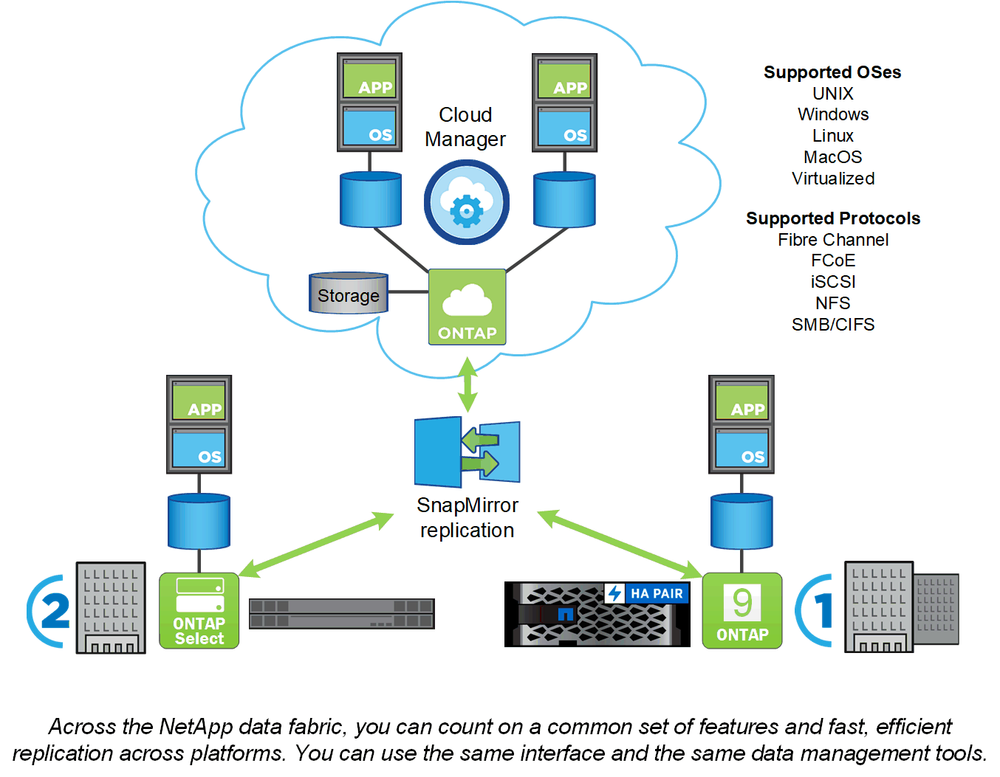

= Plataformas ONTAP
:allow-uri-read: 
:icons: font
:imagesdir: ../media/

[role="lead"]
El software de gestión de datos ONTAP ofrece almacenamiento unificado para aplicaciones que leen y escriben datos en protocolos de acceso a bloques o archivos, en configuraciones de almacenamiento que abarcan desde flash de alta velocidad hasta medios giratorios con un precio más bajo, hasta almacenamiento de objetos basado en cloud.

Las implementaciones de ONTAP se ejecutan en dispositivos FAS o AFF a medida de NetApp, en hardware genérico (ONTAP Select) y en clouds privados, públicos o híbridos (almacenamiento privado de NetApp o Cloud Volumes ONTAP). Las implementaciones especializadas ofrecen la mejor infraestructura convergente (centro de datos FlexPod) y acceso a cabinas de almacenamiento de terceros (virtualización FlexArray).

Estas implementaciones combinadas forman el marco básico del _Data Fabric de NetApp, con un enfoque común definido por software para la gestión de datos y la replicación rápida y eficiente entre plataformas.

.Acerca de la virtualización de centros de datos de FlexPod y FlexArray
Si bien no se representa en la ilustración de Data Fabric de NetApp, el centro de datos de FlexPod y la virtualización de FlexArray son implementaciones clave de ONTAP:

* FlexPod integra los mejores componentes informáticos, de almacenamiento y redes en una arquitectura flexible para cargas de trabajo empresariales. Su infraestructura convergente acelera la puesta en marcha de aplicaciones vitales para el negocio e infraestructuras de centro de datos basadas en el cloud.
* FlexArray es una solución front-end de cabinas de almacenamiento E-Series de NetApp y terceros, ofrece un conjunto uniforme de funcionalidades y una gestión de datos optimizada. Un sistema FlexArray tiene el mismo aspecto que cualquier otro sistema ONTAP y ofrece las mismas funciones.

