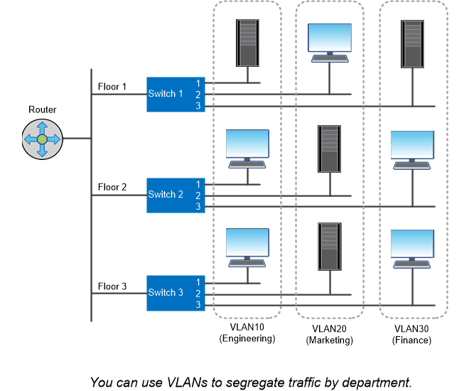

= Puertos lógicos
:allow-uri-read: 
:icons: font
:imagesdir: ../media/

[role="lead"]
Además de los puertos físicos proporcionados en cada nodo, puede utilizar _logical ports_ para gestionar el tráfico de red. Los puertos lógicos son grupos de interfaces o VLAN.

== Grupos de interfaces

_Grupos de interfaces_ combine varios puertos físicos en un único «'puerto troncal'» lógico. Puede que desee crear un grupo de interfaces compuesto por puertos de NIC en diferentes ranuras PCI para garantizar que no se produzca un fallo en una ranura, lo que reduce el tráfico empresarial esencial.

Un grupo de interfaces puede ser de modo único, multimodo o multimodo dinámico. Cada modo ofrece distintos niveles de tolerancia a fallos. Se puede usar cualquier tipo de grupo de interfaces multimodo para equilibrar la carga de tráfico de red.

== VLAN

_VLAN_ separa el tráfico de un puerto de red (que podría ser un grupo de interfaces) en segmentos lógicos definidos por puerto de switch, en lugar de por límites físicos. Las _estaciones finales_ pertenecientes a una VLAN están relacionadas por función o aplicación.

Puede agrupar las estaciones finales por departamento, como Ingeniería y Marketing, o por proyecto, como release1 y relase2. Debido a que la proximidad física de las estaciones finales es irrelevante en una VLAN, las estaciones finales pueden ser geográficamente remotas.

