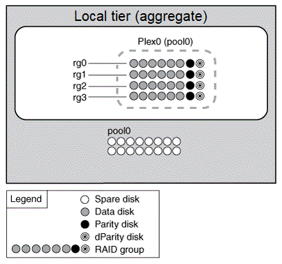

= Niveles locales (agregados) reflejados y sin mirroring
:allow-uri-read: 
:icons: font
:imagesdir: ../media/

[role="lead"]
ONTAP tiene una función opcional denominada _SyncMirror_ que puede utilizar para reflejar de forma síncrona datos del nivel local (agregado) en copias o _plexes_, almacenados en diferentes grupos RAID. Los complejos se aseguran de la pérdida de datos si fallan más discos de los que protege el tipo RAID, o si hay una pérdida de conectividad con los discos de grupo RAID.

Cuando se crea un nivel local con System Manager o mediante la CLI, es posible especificar que el nivel local se encuentre reflejado o no reflejado.

== Cómo funcionan los niveles locales (agregados) sin reflejar

Si no se especifica que los niveles locales se reflejan, estos se crean como niveles locales no reflejados (agregados). Los niveles locales no reflejados tienen solo un _plex_ (una copia de sus datos), que contiene todos los grupos RAID que pertenecen a ese nivel local.

El siguiente diagrama muestra un nivel local sin duplicación compuesto por discos, con su único complejo. El nivel local tiene cuatro grupos RAID: Rg0, rg1, rg2 y rg3. Cada grupo RAID tiene seis discos de datos, un disco de paridad y un disco dparity (doble paridad). Todos los discos utilizados por el nivel local provienen del mismo pool, "'pool0'".

El siguiente diagrama muestra un nivel local sin reflejar con los LUN de cabina, con su único complejo. Tiene dos grupos RAID, rg0 y rg1. Todos los LUN de cabina utilizados por el nivel local proceden del mismo pool "'pool0'".

image::../media/unmirrored-aggregate-with-array-luns.gif[El diagrama se describe con el texto anterior.]

== Cómo funcionan los niveles locales (agregados) reflejados

Los agregados reflejados tienen dos _plexes_ (copias de sus datos), que utilizan la funcionalidad SyncMirror para duplicar los datos y proporcionar redundancia.

Al crear un nivel local, puede especificar que sea un nivel local reflejado.  Además, puede agregar un segundo complejo a un nivel local no reflejado existente para hacerlo un nivel reflejado. Mediante la funcionalidad SyncMirror, ONTAP copia los datos del plex original (plex0) en el complejo nuevo (plex1). Los complejos están separados físicamente (cada complejo tiene sus propios grupos RAID y su propio pool), y los complejos se actualizan simultáneamente.

Esta configuración proporciona una protección añadida contra la pérdida de datos si fallan más discos, la cual protege el nivel de RAID del agregado o si se produce una pérdida de conectividad, ya que el plex no afectado sigue sirviendo datos mientras se soluciona la causa del fallo. Una vez solucionado el complejo que tenía un problema, los dos complejos se resincronizaron y restablecen la relación de reflejo.

Los discos y las LUN de matriz del sistema se dividen en dos grupos: "'pool0'" y "'pool1'". Plex0 obtiene su almacenamiento de pool0 y plex1 obtiene su almacenamiento de pool1.

En el siguiente diagrama, se muestra un nivel local compuesto por discos con la funcionalidad de SyncMirror habilitada e implementada. Se ha creado un segundo complejo para el nivel local "'plex1'". Los datos en plex1 son una copia de los datos en plex0 y los grupos RAID son también idénticos. Los 32 discos de repuesto se asignan a la piscina 0 o a la pool1 usando 16 discos para cada pool.

image::../media/drw-plexm-scrn-en-noscale.gif[El diagrama se describe con el texto anterior.]

En el siguiente diagrama, se muestra un nivel local compuesto por LUN de cabina con la funcionalidad SyncMirror habilitada e implementada. Se ha creado un segundo complejo para el nivel local "'plex1'". Plex1 es una copia de plex0 y los grupos RAID son también idénticos.

image::../media/mirrored-aggregate-with-array-luns.gif[Este diagrama se describe con el texto anterior.]

NOTE: Se recomienda mantener al menos un 20% de espacio libre para agregados reflejados para lograr un rendimiento y una disponibilidad de almacenamiento óptimos. Aunque la recomendación es del 10% para agregados no duplicados, el sistema de archivos puede utilizar el 10% adicional del espacio para absorber cambios incrementales. Los cambios incrementales aumentan el aprovechamiento del espacio para agregados reflejados gracias a la arquitectura basada en Snapshot de copia en escritura de ONTAP. Si no se siguen estas mejores prácticas, puede tener un impacto negativo en el rendimiento.
