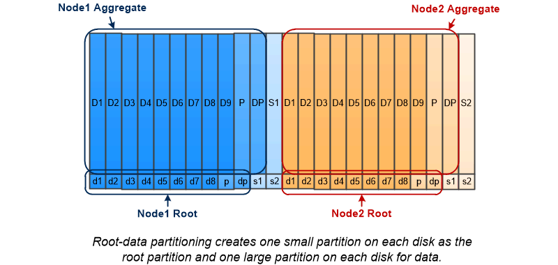

= Partición de datos raíz
:allow-uri-read: 
:icons: font
:imagesdir: ../media/

[role="lead"]
Cada nodo debe tener un agregado raíz para los archivos de configuración del sistema de almacenamiento. El agregado raíz tiene el tipo de RAID del agregado de datos.

System Manager no admite la partición de datos raíz ni datos raíz.

Un agregado raíz de tipo RAID-DP suele consistir en un disco de datos y dos discos de paridad. Esto supone un "'impuesto de paridad'" significativo a pagar por los archivos del sistema de almacenamiento, cuando el sistema ya reserva dos discos como discos de paridad para cada grupo RAID del agregado.

_Partición raíz-datos_ reduce el impuesto de paridad al distribuir el agregado raíz en las particiones de disco, reservando una partición pequeña en cada disco como partición raíz y una partición grande para los datos.

Como se indica en la ilustración, cuantos más discos se utilicen para almacenar el agregado raíz, más pequeña será la partición raíz. Este es también el caso de una forma de partición de datos raíz llamada _root-data-partitioning_, que crea una partición pequeña como la partición raíz y dos particiones más grandes y de igual tamaño para los datos.

image::../media/root-data-data.gif[ejemplo de partición de datos raíz]

Ambos tipos de particiones de datos raíz forman parte de la función ONTAP _Advanced Drive Partitioning (ADP)_. Ambos están configurados de fábrica: Creación de particiones de datos raíz para sistemas FAS2xxx, FAS9000, FAS8200, FAS80xx y AFF de gama básica, creación de particiones de datos raíz solo para sistemas AFF.

Más información acerca de link:https://kb.netapp.com/Advice_and_Troubleshooting/Data_Storage_Software/ONTAP_OS/What_are_the_rules_for_Advanced_Disk_Partitioning["Creación avanzada de particiones de unidades"^].

== Unidades con particiones y utilizadas para el agregado raíz

Las unidades que se particionan para el uso en el agregado raíz dependen de la configuración del sistema.

Saber cuántas unidades se usan para el agregado raíz ayuda a determinar la cantidad de capacidad de las unidades se reserva para la partición raíz y cuánto se encuentra disponible para usar en un agregado de datos.

La funcionalidad de creación de particiones de datos raíz es compatible con plataformas de gama básica, plataformas All Flash FAS y plataformas FAS solo con unidades SSD conectadas.

Para las plataformas de gama básica, solo se crean particiones de las unidades internas.

Para las plataformas All Flash FAS y las plataformas FAS con solo SSD conectados, todas las unidades conectadas a la controladora cuando se inicializa el sistema se crean en particiones, hasta un límite de 24 por nodo. Las unidades que se añaden después de la configuración del sistema no particionan.
