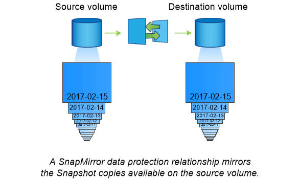

= Recuperación ante desastres y transferencia de datos con SnapMirror
:allow-uri-read: 
:icons: font
:imagesdir: ../media/

[role="lead"]
_SnapMirror_ es la tecnología de recuperación ante desastres diseñada para la conmutación al nodo de respaldo del almacenamiento principal al secundario en un sitio geográficamente remoto. Como su nombre indica, SnapMirror crea una réplica, o _mirror,_ de sus datos de trabajo en el almacenamiento secundario desde el cual puede continuar proporcionando datos en caso de catástrofe en el sitio principal.

Los datos se reflejan en el nivel de volumen. La relación entre el volumen de origen del almacenamiento primario y el volumen de destino del almacenamiento secundario se denomina «relación de protección de datos»._ los clústeres en los que residen los volúmenes y las SVM que sirven datos de los volúmenes deben tener una relación entre iguales._ Una relación entre iguales permite que los clústeres y las SVM se intercambien datos con seguridad.

[TIP]
====
También puede crear una relación de protección de datos entre las SVM. En este tipo de relación, se replica toda la configuración de la SVM, desde las exportaciones de NFS y los recursos compartidos de SMB hasta RBAC, así como los datos en los volúmenes que posee la SVM.

====
A partir de ONTAP 9.10.1, se pueden crear relaciones de protección de datos entre bloques de S3 mediante SnapMirror S3. Los bloques de destino pueden estar en sistemas ONTAP locales o remotos, o en sistemas que no sean ONTAP, como StorageGRID y AWS.

La primera vez que se invoca SnapMirror, se realiza una transferencia _baseline_ del volumen de origen al volumen de destino. La transferencia inicial suele consistir en los siguientes pasos:

* Haga una copia Snapshot del volumen de origen.
* Transfiera la copia Snapshot y todos los bloques de datos que hace referencia al volumen de destino.
* Transferir las copias snapshot restantes y menos recientes del volumen de origen al volumen de destino para su uso en caso de que el espejo «activo» esté dañado.

Una vez finalizada la transferencia completa, SnapMirror solo transfiere las nuevas copias Snapshot al duplicado. Las actualizaciones son asíncronas, según la programación configurada. La retención refleja la política de Snapshot en el origen. Se puede activar el volumen de destino con una interrupción mínima en caso de desastre en el sitio primario y reactivar el volumen de origen cuando el servicio se restaure.

Dado que SnapMirror solo transfiere copias Snapshot una vez que se haya creado la configuración básica, la replicación es rápida y no disruptiva. Como se indica en el caso de uso de conmutación por error, las controladoras del sistema secundario deben ser equivalentes o casi equivalentes a las controladoras del sistema primario para servir datos de forma eficiente desde el almacenamiento reflejado.

|===

 a| 
*_uso de SnapMirror para la transferencia de datos_*

También se puede usar SnapMirror para replicar datos entre extremos en el Data Fabric de NetApp. Puede elegir entre una replicación que desee o una replicación recurrente al crear la política de SnapMirror.

|===