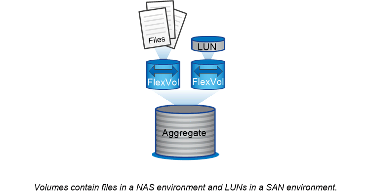

= Volúmenes, qtrees, archivos y LUN
:allow-uri-read: 
:icons: font
:imagesdir: ../media/

[role="lead"]
ONTAP ofrece datos a los clientes y hosts a partir de contenedores lógicos denominados volúmenes _FlexVol._ dado que estos volúmenes solo se asocian de forma flexible con su agregado que lo contiene, ofrecen una mayor flexibilidad a la hora de gestionar datos que los volúmenes tradicionales.

Puede asignar varios volúmenes de FlexVol a un agregado, cada uno dedicado a una diferente aplicación o servicio. Puede ampliar y contraer un volumen de FlexVol, mover un volumen de FlexVol y realizar copias eficientes de un volumen de FlexVol. Puede usar _Qtrees_ para dividir un volumen FlexVol en unidades más gestionables, y _Quotas_ para limitar el uso de recursos por volumen.

Los volúmenes contienen sistemas de archivos en un entorno NAS y LUN en UN entorno SAN. Un LUN (número de unidad lógica) es un identificador de un dispositivo llamado _unidad lógica_ que se dirige mediante un protocolo SAN.

Los LUN son la unidad básica de almacenamiento en una configuración SAN. El host de Windows ve los LUN en el sistema de almacenamiento como discos virtuales. Puede mover LUN de forma no disruptiva a diferentes volúmenes según sea necesario.

Además de los volúmenes de datos, es necesario conocer algunos volúmenes especiales:

* Un _node root volume_ (normalmente "'vol0'") contiene información y registros de configuración del nodo.
* Un volumen raíz _SVM_ actúa como punto de entrada del espacio de nombres que proporciona la SVM y contiene información del directorio de espacios de nombres.
* _System Volumes_ contiene metadatos especiales, como registros de auditoría de servicio.

No se pueden usar estos volúmenes para almacenar datos.

|===

 a| 
*_volúmenes de FlexGroup_*

En algunas empresas, un espacio de nombres único puede requerir petabytes de almacenamiento, lo que supera con creces la capacidad de 100 TB de un volumen FlexVol.

Un _FlexGroup volume_ admite hasta 400 mil millones de archivos con 200 volúmenes constituyentes que trabajan conjuntamente para equilibrar dinámicamente la carga y la asignación de espacio de forma uniforme entre todos los miembros.

Gracias a los volúmenes de FlexGroup, no se incurre en gastos generales de mantenimiento o gestión. Simplemente puede crear el volumen FlexGroup y compartirlo con sus clientes NAS. ONTAP se encarga del resto.

|===