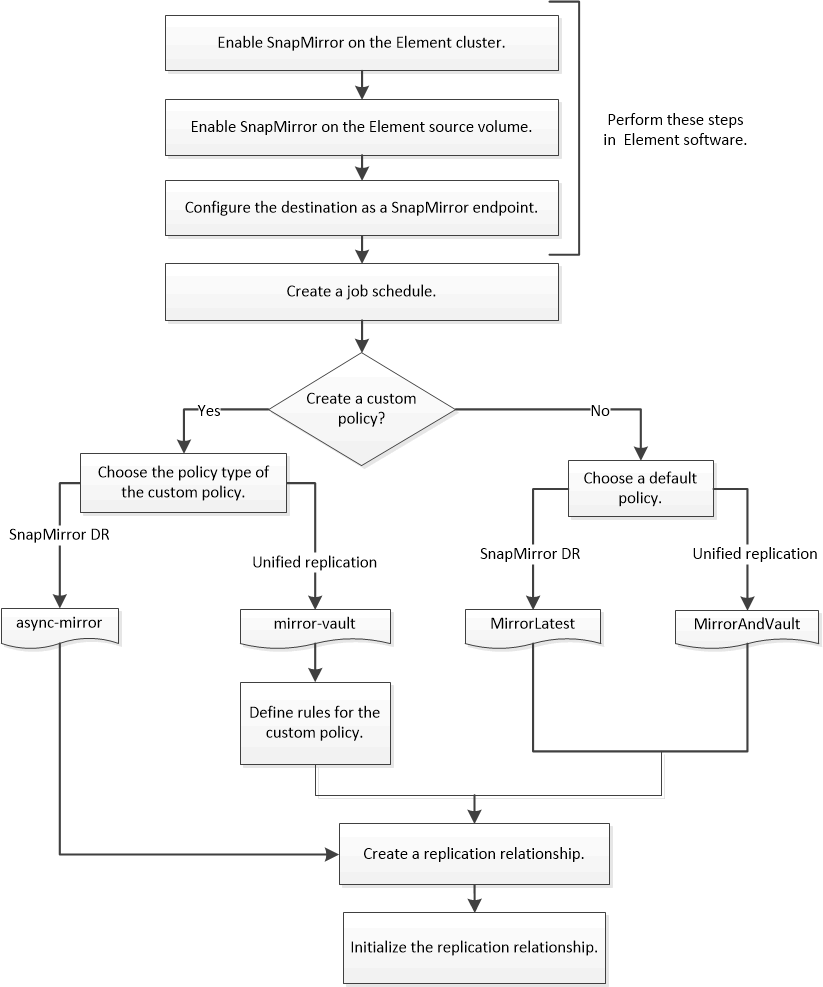

= Flujo de trabajo de replicación entre Element y ONTAP
:allow-uri-read: 
:icons: font
:imagesdir: ../media/

[role="lead"]
Si va a replicar datos de Element en ONTAP o de ONTAP a Element, debe configurar una programación de trabajo, especificar una política y crear e inicializar la relación. Puede usar una directiva predeterminada o personalizada.

En el flujo de trabajo se supone que ha completado las tareas de requisitos previos que se enumeran en xref:index.adoc#prerequisites[Requisitos previos]. Para obtener información de referencia completa sobre las políticas de SnapMirror, incluidas las directrices sobre qué política usar, consulte link:../data-protection/index.html["Protección de datos"].

