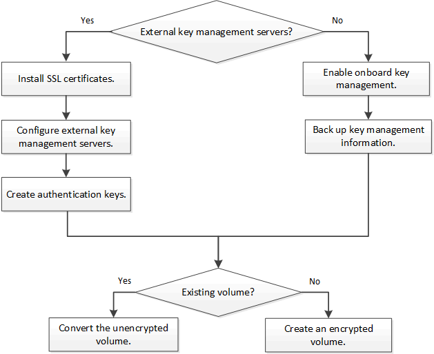

= Flujo de trabajo de cifrado de volúmenes de NetApp
:allow-uri-read: 
:icons: font
:imagesdir: ../media/

[role="lead"]
Es necesario configurar servicios de gestión de claves para poder habilitar el cifrado de volúmenes. Puede habilitar el cifrado en un volumen nuevo o en uno existente.

Debe instalar la licencia ve y configurar los servicios de gestión de claves para poder cifrar los datos con NVE. Antes de instalar la licencia, debería link:luster-version-support-nve-task.html["Determine si la versión de ONTAP es compatible con NVE"].
