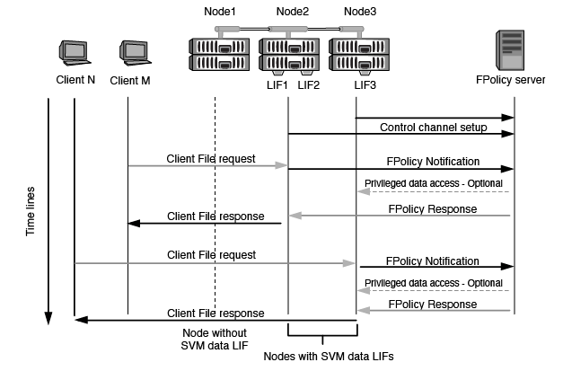

= Qué es el proceso de comunicación entre el servidor FPolicy externo y el nodo
:allow-uri-read: 
:icons: font
:imagesdir: ../media/

[role="lead"]
Para planificar correctamente la configuración de FPolicy, debe comprender cuál es el proceso de comunicación entre servidores FPolicy externos.

Cada nodo que participa en cada máquina virtual de almacenamiento (SVM) inicia una conexión con un servidor de FPolicy externo (servidor FPolicy) mediante TCP/IP. Las conexiones con los servidores FPolicy se configuran mediante LIF de datos de nodos; por lo tanto, un nodo participante solo puede configurar una conexión si el nodo tiene una LIF de datos operativa para la SVM.

Cada proceso de FPolicy en los nodos participantes intenta establecer una conexión con el servidor FPolicy cuando se habilite la política. Utiliza la dirección IP y el puerto del motor externo de FPolicy especificado en la configuración de directivas.

La conexión establece un canal de control desde cada uno de los nodos que participan en cada SVM al servidor FPolicy a través de la LIF de datos. Además, si las direcciones LIF de datos IPv4 e IPv6 están presentes en el mismo nodo participante, FPolicy intenta establecer conexiones tanto para IPv4 como IPv6. Por lo tanto, en una situación en la que la SVM se extiende por varios nodos o si hay direcciones IPv4 e IPv6 presentes, el servidor de FPolicy debe estar preparado para varias solicitudes de configuración de canal de control desde el clúster después de habilitar la política FPolicy en la SVM.

Por ejemplo, si un clúster tiene tres nodos (Node1, Node2 y Node3) y los LIF de datos de SVM se distribuyen en Node2 y Node3, los canales de control se inician solo desde Node2 y Node3, independientemente de la distribución de los volúmenes de datos. Supongamos que Node2 tiene dos LIF de datos (LIF1 y LIF2) que pertenecen a la SVM y que la conexión inicial es de LIF1. Si LIF1 falla, FPolicy intenta establecer un canal de control desde LIF2.

== Cómo gestiona FPolicy la comunicación externa durante la migración LIF o la conmutación al nodo de respaldo

Los LIF de datos pueden migrarse a puertos de datos del mismo nodo o a puertos de datos de un nodo remoto.

Cuando se produce un error en una LIF de datos o se migra, se establece una nueva conexión de canal de control al servidor de FPolicy. A continuación, FPolicy puede volver a intentar solicitudes de clientes SMB y NFS que agoten el tiempo de espera, con el resultado de enviar nuevas notificaciones a los servidores de FPolicy externos. El nodo rechaza las respuestas del servidor de FPolicy frente a las solicitudes originales de SMB y NFS que han superado el tiempo de espera.

== Cómo gestiona FPolicy la comunicación externa durante la conmutación al nodo de respaldo

Si el nodo del clúster que aloja los puertos de datos utilizados para la comunicación de FPolicy falla, ONTAP interrumpe la conexión entre el servidor de FPolicy y el nodo.

El impacto de la conmutación por error de clúster en el servidor FPolicy se puede mitigar configurando la política de conmutación por error para migrar el puerto de datos utilizado en la comunicación de FPolicy a otro nodo activo. Una vez finalizada la migración, se establece una nueva conexión con el nuevo puerto de datos.

Si la política de conmutación por error no está configurada para migrar el puerto de datos, el servidor FPolicy debe esperar a que se active el nodo fallido. Una vez que el nodo está en funcionamiento, se inicia una nueva conexión desde ese nodo con un nuevo ID de sesión.

[NOTE]
====
El servidor FPolicy detecta conexiones rotas con el mensaje de protocolo Keep-alive. El tiempo de espera para purgar el ID de sesión se determina al configurar FPolicy. El tiempo de espera de mantenimiento activo predeterminado es de dos minutos.

====