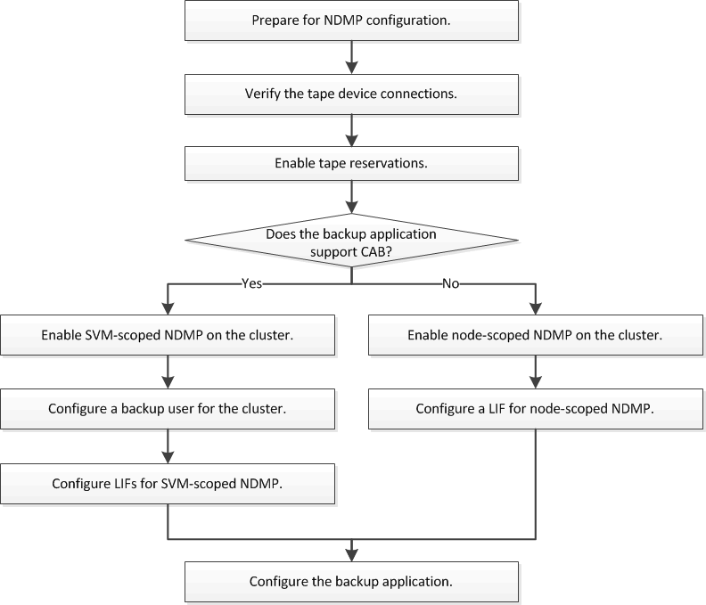

= Flujo de trabajo de configuración de NDMP
:allow-uri-read: 
:icons: font
:imagesdir: ../media/

[role="lead"]
La configuración del backup en cinta mediante NDMP implica preparar la configuración NDMP, verificar las conexiones del dispositivo de cinta, habilitar las reservas en cinta, configurar NDMP en el nivel de SVM o nodo, habilitar NDMP en el clúster, configurar un usuario de backup, configurar LIF y configurar la aplicación de backup.

