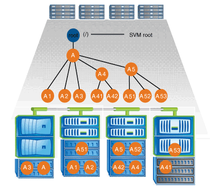
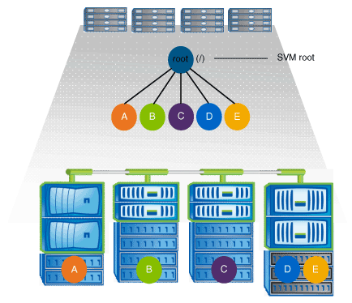

= Cuáles son las arquitecturas de espacio de nombres NAS típicas
:allow-uri-read: 
:icons: font
:imagesdir: ../media/

[role="lead"]
Existen varias arquitecturas de espacio de nombres NAS típicas que se pueden usar a medida que se crea el espacio de nombres de la SVM. Puede elegir la arquitectura de espacio de nombres que se ajuste a sus necesidades empresariales y de flujos de trabajo.

El principio del espacio de nombres siempre es el volumen raíz, que se representa mediante una barra diagonal (/). La arquitectura del espacio de nombres en la raíz se divide en tres categorías básicas:

* Un árbol ramificado único, con una única unión a la raíz del espacio de nombres
* Múltiples árboles ramificados, con varios puntos de unión en la raíz del espacio de nombres
* Varios volúmenes independientes, cada uno con un punto de unión separado en la raíz del espacio de nombres

== Espacio de nombres con árbol ramificado único

Una arquitectura con un único árbol ramificado tiene un único punto de inserción en la raíz del espacio de nombres de SVM. El único punto de inserción puede ser un volumen junted o un directorio debajo de la raíz. Los demás volúmenes se montan en puntos de unión debajo del punto de inserción único (que puede ser un volumen o un directorio).

Por ejemplo, una configuración de unión de volúmenes típica con la arquitectura de espacio de nombres anterior podría tener el aspecto de la siguiente configuración, donde todos los volúmenes se unen por debajo del punto de inserción único, que es un directorio denominado «data»:

[listing]
----

                     Junction                       Junction
Vserver Volume       Active   Junction Path         Path Source
------- ------------ -------- -------------------   -----------
vs1     corp1        true     /data/dir1/corp1      RW_volume
vs1     corp2        true     /data/dir1/corp2      RW_volume
vs1     data1        true     /data/data1           RW_volume
vs1     eng1         true     /data/data1/eng1      RW_volume
vs1     eng2         true     /data/data1/eng2      RW_volume
vs1     sales        true     /data/data1/sales     RW_volume
vs1     vol1         true     /data/vol1            RW_volume
vs1     vol2         true     /data/vol2            RW_volume
vs1     vol3         true     /data/vol3            RW_volume
vs1     vs1_root     -        /                     -
----

== Espacio de nombres con varios árboles ramificados

Una arquitectura con varios árboles ramificados tiene varios puntos de inserción en la raíz del espacio de nombres de la SVM. Los puntos de inserción pueden ser volúmenes de juntados o directorios debajo de la raíz. Los demás volúmenes se montan en puntos de unión debajo de los puntos de inserción (que pueden ser volúmenes o directorios).

Por ejemplo, una configuración típica de unión de volúmenes con la arquitectura anterior del espacio de nombres puede parecer la siguiente configuración, donde hay tres puntos de inserción en el volumen raíz de la SVM. Dos puntos de inserción son directorios denominados «dé» y «proyectos». Un punto de inserción es un volumen Unido denominado «'audit'»:

[listing]
----

                     Junction                       Junction
Vserver Volume       Active   Junction Path         Path Source
------- ------------ -------- -------------------   -----------
vs1     audit        true     /audit                RW_volume
vs1     audit_logs1  true     /audit/logs1          RW_volume
vs1     audit_logs2  true     /audit/logs2          RW_volume
vs1     audit_logs3  true     /audit/logs3          RW_volume
vs1     eng          true     /data/eng             RW_volume
vs1     mktg1        true     /data/mktg1           RW_volume
vs1     mktg2        true     /data/mktg2           RW_volume
vs1     project1     true     /projects/project1    RW_volume
vs1     project2     true     /projects/project2    RW_volume
vs1     vs1_root     -        /                     -
----

== Espacio de nombres con varios volúmenes independientes

En una arquitectura con volúmenes independientes, cada volumen tiene un punto de inserción en la raíz del espacio de nombres de SVM; sin embargo, el volumen no se ha Unido por debajo de otro volumen. Cada volumen tiene una ruta única y se conecta directamente debajo de la raíz o se conecta bajo un directorio debajo de la raíz.

Por ejemplo, una configuración típica de unión de volúmenes con la arquitectura anterior del espacio de nombres puede parecer la siguiente configuración, donde hay cinco puntos de inserción en el volumen raíz de la SVM, donde cada punto de inserción representa una ruta a un volumen.

[listing]
----

                     Junction                       Junction
Vserver Volume       Active   Junction Path         Path Source
------- ------------ -------- -------------------   -----------
vs1     eng          true     /eng                  RW_volume
vs1     mktg         true     /vol/mktg             RW_volume
vs1     project1     true     /project1             RW_volume
vs1     project2     true     /project2             RW_volume
vs1     sales        true     /sales                RW_volume
vs1     vs1_root     -        /                     -
----