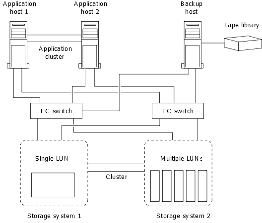

= Cómo se puede conectar un sistema de backup de host al sistema de almacenamiento primario
:allow-uri-read: 
:icons: font
:imagesdir: ../media/

[role="lead"]
Se puede lanzar backups de sistemas SAN a cinta a través de un host de backup independiente para evitar que el rendimiento se resienta en el host de aplicaciones.

Es imprescindible mantener separados los datos DE SAN y NAS con fines de backup. La siguiente figura muestra la configuración física recomendada para un sistema de backup host al sistema de almacenamiento principal. Debe configurar los volúmenes como solo SAN. Las LUN pueden quedar limitadas a un único volumen o las LUN pueden propagarse por varios volúmenes o sistemas de almacenamiento.

Los volúmenes de un host pueden consistir en una única LUN asignada desde el sistema de almacenamiento o de varias LUN mediante un gestor de volúmenes, como VxVM en sistemas HP-UX.
