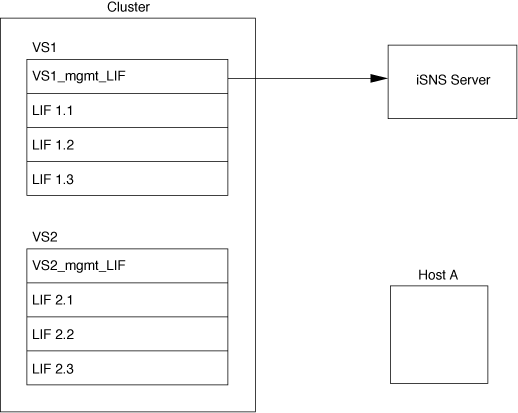

= Servicio de nombres de almacenamiento de Internet (iSNS)
:allow-uri-read: 
:icons: font
:imagesdir: ../media/

[role="lead"]
El servicio de nombres de almacenamiento de Internet (iSNS) es un protocolo que permite la detección y gestión automatizadas de dispositivos iSCSI en una red de almacenamiento TCP/IP. Un servidor iSNS mantiene información sobre dispositivos iSCSI activos en la red, incluidas sus direcciones IP, los nombres de nodos iSCSI IQN y los grupos de portales.

Puede obtener un servidor iSNS de un proveedor tercero. Si posee un servidor iSNS en la red configurado y habilitado para su uso por parte del iniciador y el destino, puede usar la LIF de gestión para una máquina virtual de almacenamiento (SVM) para registrar todos los LIF iSCSI para esa SVM en el servidor iSNS. Una vez completado el registro, el iniciador de iSCSI puede consultar el servidor iSNS para detectar todas las LIF de esa SVM en particular.

Si decide utilizar un servicio iSNS, debe asegurarse de que las máquinas virtuales de almacenamiento (SVM) estén registradas correctamente en un servidor de servicio de nombres de almacenamiento de Internet (iSNS).

Si no tiene un servidor iSNS en la red, debe configurar manualmente cada objetivo para que sea visible para el host.

== Lo que hace un servidor iSNS

Un servidor iSNS utiliza el protocolo de servicio de nombres de almacenamiento de Internet (iSNS) para mantener información sobre los dispositivos iSCSI activos en la red, incluidas sus direcciones IP, nombres de nodos iSCSI (IQN) y grupos de portales.

El protocolo iSNS permite la detección y gestión automatizadas de dispositivos iSCSI en una red de almacenamiento IP. Un iniciador de iSCSI puede consultar el servidor iSNS para detectar dispositivos de destino iSCSI.

NetApp no suministra ni distribuye servidores iSNS. Puede obtener estos servidores de un proveedor con soporte de NetApp.

== Cómo interactúan las SVM con un servidor iSNS

El servidor iSNS se comunica con cada máquina virtual de almacenamiento (SVM) a través de la LIF de gestión de SVM. La LIF de gestión registra toda la información de portal, alias y nombre del nodo de destino de iSCSI con el servicio iSNS para una SVM específica.

En el siguiente ejemplo, SVM «`VS1`» utiliza la LIF de gestión de SVM «`VS1_mgmt_lif`» para registrarse en el servidor iSNS. Durante el registro de iSNS, una SVM envía todas las LIF de iSCSI a través de la LIF de gestión de SVM al servidor iSNS. Una vez completado el registro de iSNS, el servidor iSNS tendrá una lista de todas las LIF que sirven iSCSI en «`VS1`». Si un clúster contiene varias SVM, cada SVM debe registrarse individualmente con el servidor iSNS para utilizar el servicio iSNS.

En el siguiente ejemplo, después de que el servidor iSNS complete el registro con el destino, el Host A puede detectar todas las LIF para '`VS1`' a través del servidor iSNS como se indica en el Paso 1. Una vez que el Host A completa el descubrimiento de las LIF para «`VS1`», el Host A puede establecer una conexión con cualquiera de las LIF en «`VS1`», tal como se muestra en el Paso 2. El host A no tiene en cuenta ninguna de las LIF incluidas en «`VS2`» hasta que la LIF de gestión «`VS2_mgmt_LIF`» para registros «`VS2`» en el servidor iSNS.

image::../media/bsag_c-mode_iSNS_connect.png[Conexión iSNS en modo bsag c]

Sin embargo, si define las listas de acceso de interfaz, el host solo puede usar las LIF definidas en la lista de acceso de interfaz para acceder al destino.

Una vez que se configura inicialmente iSNS, ONTAP actualiza automáticamente el servidor iSNS cuando cambian las opciones de configuración de SVM.

Es posible que se produzca una demora de unos minutos entre el momento en que realiza cambios en la configuración y la hora en que ONTAP envía la actualización al servidor iSNS. Forzar una actualización inmediata de la información de iSNS en el servidor iSNS: `vserver iscsi isns update`

== Comandos para gestionar iSNS

ONTAP proporciona comandos para gestionar el servicio iSNS.

|===

| Si desea... | Se usa este comando... 

 a| 
Configure un servicio iSNS
 a| 
`vserver iscsi isns create`

 a| 
Inicie un servicio iSNS
 a| 
`vserver iscsi isns start`

 a| 
Modifique un servicio iSNS
 a| 
`vserver iscsi isns modify`

 a| 
Muestra la configuración de servicio iSNS
 a| 
`vserver iscsi isns show`

 a| 
Fuerza una actualización de la información de iSNS registrada
 a| 
`vserver iscsi isns update`

 a| 
Detenga un servicio iSNS
 a| 
`vserver iscsi isns stop`

 a| 
Quite un servicio iSNS
 a| 
`vserver iscsi isns delete`

 a| 
Vea la página man de un comando
 a| 
`man _command name_`

|===
Consulte la página de manual de cada comando para obtener más información.
