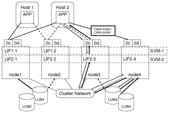

= Cómo funciona el acceso de LUN en un entorno virtualizado
:allow-uri-read: 
:icons: font
:imagesdir: ../media/

[role="lead"]
En un entorno virtualizado, las LIF permiten que los hosts (clientes) accedan a las LUN a través de rutas optimizadas y sin optimizar.

Una LIF es una interfaz lógica que conecta la SVM a un puerto físico. Aunque varias SVM pueden tener varios LIF en el mismo puerto, un LIF pertenece a una SVM. Puede acceder a las LUN a través de las LIF de SVM.

.Ejemplo de acceso de LUN con una única SVM en un clúster
En el siguiente ejemplo, el host 1 se conecta a LIF1.1 y LIF1.2 en SVM-1 para acceder a LUN1. LIF1.1 utiliza el puerto físico 1:0c y LIF1.2:0c. LIF1.1 y LIF1.2 sólo pertenecen a SVM-1. Si se crea una nueva LUN en el nodo 1 o en el nodo 2, para SVM-1, puede usar estas mismas LIF. Si se crea una nueva SVM, pueden crearse nuevas LIF con los puertos físicos 0c o 0d de ambos nodos.

image::../media/bsag-c-mode-1-lif-belongs-1-vs.gif[Acceso de SVM a LUN1]

.Ejemplo de acceso de la LUN con varias SVM en un clúster
Un puerto físico puede admitir varios LIF que sirven a diferentes SVM. Dado que los LIF están asociados con una SVM determinada, los nodos del clúster pueden enviar el tráfico de datos entrantes a la SVM correcta. En el ejemplo siguiente, cada nodo del 1 al 4 tiene una LIF para SVM-2 utilizando el puerto físico 0c de cada nodo. El host 1 se conecta a LIF1.1 y LIF1.2 en SVM-1 para acceder a LUN1. El host 2 se conecta al LIF2-1 y al LIF2-2 en la SVM-2 para acceder a LUN2. Ambas SVM comparten el puerto físico 0c en los nodos 1 y 2. SVM-2 tiene LIF adicionales que utiliza el host 2 para acceder a las LUN 3 y 4. Estos LIF están utilizando el puerto físico 0c en los nodos 3 y 4. Varias SVM pueden compartir los puertos físicos en los nodos.

image::../media/bsag-c-mode-multiple-lifs-vservers.gif[2 LIF en 2 para 2 vServers]

.Ejemplo de una ruta activa o optimizada a una LUN desde un sistema host
En una ruta activa o optimizada, el tráfico de datos no viaja a través de la red de clúster; viaja por la ruta más directa a la LUN. La ruta activa o optimizada a LUN1 se realiza a través de LIF1.1 en el nodo 1, utilizando 0c de puerto físico. El host 2 tiene dos rutas activas o optimizadas, una ruta al nodo 1, LIF2.1, que comparte el puerto físico 0c y la otra ruta al nodo 4, LIF2.4, que utiliza el puerto físico 0c.

image::../media/bsag-c-mode-unoptimized-path.gif[ejemplo de una ruta optimizada]

.Ejemplo de una ruta de acceso activa o no optimizada (indirecta) a una LUN desde un sistema host
En una ruta de ruta activa o no optimizada (indirecta), el tráfico de datos viaja por la red de clúster. Este problema se produce solo si todas las rutas activas o optimizadas de un host no están disponibles para manejar el tráfico. Si se pierde la ruta desde el host 2 a la SVM-2 LIF2.4, el acceso a LUN3 y LUN4 atraviesa la red de clúster. El acceso desde el host 2 utiliza LIF2.3 en el nodo 3. A continuación, el tráfico entra en el switch de red de clúster y realiza una copia de seguridad de hasta node4 para acceder a LUN3 y LUN4. A continuación, volverá a atravesar el switch de red del clúster y, a continuación, volverá a pasar por LIF2.3 al host 2. Esta ruta activa o no optimizada se utiliza hasta que se restaura la ruta al LIF2.4 o se establece un nuevo LIF para SVM-2 en otro puerto físico del nodo 4.

