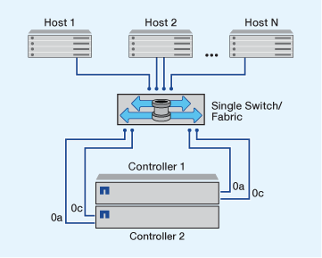

= Formas de configurar hosts SAN FC y FC-NVMe con parejas de alta disponibilidad
:allow-uri-read: 
:icons: font
:imagesdir: ../media/

[role="lead"]
Puede configurar hosts SAN FC y FC-NVMe para conectarse a los pares de alta disponibilidad a través de una o varias estructuras. No puede conectar directamente hosts SAN FC o FC-NVMe a parejas de alta disponibilidad sin utilizar un switch.

Puede configurar hosts SAN FC y FC-NVMe con pares de alta disponibilidad de estructura única o con pares de alta disponibilidad de estructura múltiple. Los números de puertos de destino FC (0a, 0c, 0d, 1a, 1b) en las ilustraciones son ejemplos. Los números de puerto reales varían según el modelo de su nodo de almacenamiento y si usa adaptadores de expansión.

== Pares de alta disponibilidad de estructura única

En configuraciones de pareja de alta disponibilidad de estructura única, existe una estructura que conecta ambas controladoras en el par de alta disponibilidad a uno o varios hosts. Dado que los hosts y las controladoras están conectados mediante un único switch, los pares de alta disponibilidad de estructura única no son completamente redundantes.

Todas las plataformas que admiten las configuraciones FC admiten configuraciones de par de alta disponibilidad de estructura única.

== Pares de alta disponibilidad estructura múltiple

En los pares de alta disponibilidad de estructura múltiple, hay dos o más switches que conectan pares de alta disponibilidad con uno o más hosts. Para mayor simplicidad, la siguiente figura de par de alta disponibilidad de estructura múltiple muestra solo dos estructuras, pero puede tener dos o más estructuras en cualquier configuración de estructura múltiple:

image::../media/scrn_en_drw_fc-32xx-multi-HA.png[Diagrama de par de estructura múltiple de alta disponibilidad]
