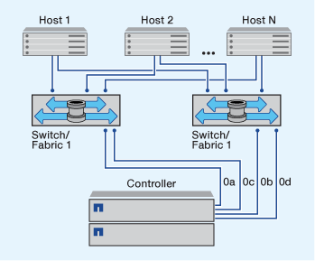

= Formas de configurar hosts SAN FC y FC-NVMe con nodos únicos
:allow-uri-read: 
:icons: font
:imagesdir: ../media/

[role="lead"]
Puede configurar hosts SAN FC y FC-NVMe con nodos únicos a través de una o varias estructuras. Se requiere virtualización de N-Port ID (NPIV) y debe habilitarse en todos los switches de FC de la estructura. No puede conectar directamente hosts SAN FC o FC-NMVE a nodos individuales sin usar un switch FC.

Puede configurar hosts SAN FC o FC-NVMe con nodos únicos a través de una única estructura o varias ventanas. Los puertos de destino FC (0a, 0c, 0b, 0d) en las ilustraciones son ejemplos. Los números de puerto reales varían según el modelo de su nodo de almacenamiento y si usa adaptadores de expansión.

== Configuraciones de nodo único con estructura única

En configuraciones de estructura única de nodo único, hay un switch que conecta un nodo único a uno o varios hosts. Dado que hay un único switch, esta configuración no es completamente redundante. Todas las plataformas de hardware que admiten FC y FC-NVMe admiten configuraciones de un único nodo de estructura.

== Configuraciones de nodo único estructura múltiple

En configuraciones de nodo único de estructura múltiple, hay dos o más switches que conectan un único nodo a uno o varios hosts. Para mayor simplicidad, la siguiente figura muestra una configuración de un solo nodo de estructura múltiple con dos estructuras, pero puede tener dos o más estructuras en cualquier configuración de estructura múltiple. En esta figura, el controlador de almacenamiento está montado en el chasis superior y el chasis inferior puede estar vacío o tener un módulo IOMX, como lo hace en este ejemplo.

.Información relacionada
http://www.netapp.com/us/media/tr-4684.pdf["Informe técnico de NetApp 4684: Implementación y configuración de San modernas con NVMe/FC"^]
