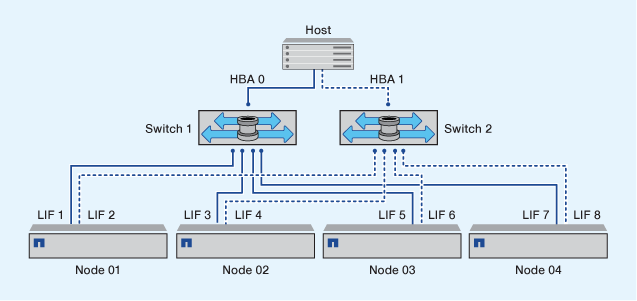

= División en zonas de pares de alta disponibilidad de estructura doble
:allow-uri-read: 
:icons: font
:imagesdir: ../media/

[role="lead"]
En configuraciones de estructura doble, puede conectar cada iniciador de host a cada nodo del clúster. Cada iniciador de host utiliza un switch diferente para acceder a los nodos del clúster. Se requiere un software multivía en el host para administrar varias rutas.

Las configuraciones de estructura doble se consideran de alta disponibilidad porque se mantiene el acceso a los datos en caso de que falle un único componente.

En la figura siguiente, el host tiene dos iniciadores y está ejecutando un software multivía. Hay dos zonas. SLM se configura de modo que todos los nodos se consideran nodos de generación de informes.

[NOTE]
====
La convención de nomenclatura utilizada en esta figura es solo una recomendación de una posible convención de nomenclatura que puede usar para su solución de ONTAP.

====
* Zona 1: HBA 0, LIF_1, LIF_3, LIF_5 y LIF_7
* Zona 2: HBA 1, LIF_2, LIF_4, LIF_6 y LIF_8

Cada iniciador de host se zonas mediante un switch diferente. Se accede a la zona 1 a través del conmutador 1. Se accede a la zona 2 a través del conmutador 2.

Cada iniciador puede acceder a una LIF en todos los nodos. Esto permite que el host siga teniendo acceso a sus LUN si un nodo da error. Los SVM tienen acceso a todos los LIF iSCSI y FC de todos los nodos de una solución en clúster según el ajuste de asignación de LUN selectiva (SLM) y la configuración del nodo de generación de informes. Puede utilizar la división en zonas de SLM, conjuntos de puertos o switch de FC para reducir el número de rutas de una SVM al host y el número de rutas de una SVM a un LUN.

Si la configuración incluía más nodos, las LIF de los nodos adicionales se incluirían en estas zonas.

[NOTE]
====
El sistema operativo host y el software multivía tienen que admitir el número de rutas que se están utilizando para acceder a las LUN en los nodos.

====
.Información relacionada
https://hwu.netapp.com["Hardware Universe de NetApp"^]
