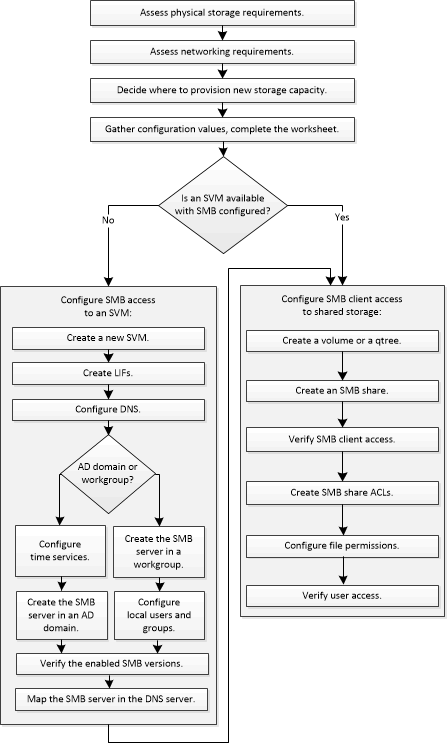

= Flujo de trabajo de configuración de SMB
:allow-uri-read: 
:icons: font
:imagesdir: ../media/

[role="lead"]
La configuración de SMB implica evaluar los requisitos de almacenamiento físico y de red y, a continuación, elegir un flujo de trabajo específico del objetivo; configurar el acceso de SMB a una SVM nueva o existente; o añadir un volumen o qtree a una SVM existente que ya esté completamente configurada para el acceso del bloque de mensajes del servidor.

