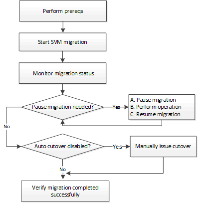

= Información general sobre movilidad de datos de SVM
:allow-uri-read: 
:icons: font
:imagesdir: ../media/

[role="lead"]
A partir de ONTAP 9.10.1, los administradores del clúster pueden reubicar de forma no disruptiva una SVM desde un clúster de origen a un clúster de destino para gestionar la capacidad y el balanceo de carga, o para permitir actualizaciones de equipos o consolidaciones de centros de datos mediante la interfaz de línea de comandos de ONTAP.

Esta funcionalidad de reubicación de SVM no disruptiva es compatible con las plataformas AFF en ONTAP 9.10.1 y 9.11.1. A partir de ONTAP 9.12.1, esta funcionalidad es compatible tanto con las plataformas FAS como AFF y los agregados híbridos.

El nombre y el UUID de la SVM no cambian después de la migración, así como el nombre de la LIF de datos, la dirección IP y los nombres de objetos, como el nombre del volumen. El UUID de los objetos de la SVM será diferente.

== Flujo de trabajo de migración de SVM

El diagrama muestra el flujo de trabajo típico para una migración de SVM. Puede iniciar una migración de SVM desde el clúster de destino. Puede supervisar la migración desde el origen o desde el destino. Puede realizar una transición manual o una transición automática. De forma predeterminada, se realiza una transición automática.

== Configuraciones admitidas

La tabla indica las configuraciones compatibles y las versiones ONTAP en las que está disponible compatibilidad.

[cols="3,1,1,1,1"]
|===

| Configuración compatible en... | ONTAP 9.10.1 | ONTAP 9.11.1 | ONTAP 9.12.1 | ONTAP 9.13.1 

| Cabinas AFF | Sí | Sí | Sí | Sí 

| Plataformas FAS y plataformas mixtas (AFF-FAS, FAS-AFF, AFF-FAS con agregados híbridos) | No | No | Sí | Sí 

| Total de cabinas/parejas de nodos | 1 | 3 | 3 | 6 

| Migrar dentro de un centro de datos y una latencia de red máxima de: | 2 ms | 2 ms | 10 ms | 10 ms 
|===

== Requisitos previos

* Debe ser administrador de clústeres
* Los clústeres de origen y destino deben tener una relación entre sí con una relación entre iguales
+
link:https://review.docs.netapp.com/us-en/ontap_main/peering/create-cluster-relationship-93-later-task.html["Cree una relación de paridad entre clústeres"]

* Los clústeres de origen y destino deben tener instalada la licencia de bundle de protección de datos
* Todos los nodos del clúster de origen deben ejecutar ONTAP 9.10.1 o una versión posterior
* Todos los nodos del clúster de origen deben ejecutar la misma versión de ONTAP
* El clúster de destino debe tener la misma versión de clúster efectiva (ECV) o una más reciente que el clúster de origen
* Los clústeres de origen y destino deben admitir la misma subred IP para el acceso a LIF de datos
* La red que conecta los clusters de origen y destino debe tener un tiempo máximo de ida y vuelta (RTT) de menos de 10ms
* La SVM de origen debe contener una cantidad menor que la cantidad máxima de volúmenes de datos admitidos para la versión. El número máximo de volúmenes de datos admitidos es el siguiente:
+
** Cabinas de AFF: Volúmenes de datos de 200 TB con clústeres que ejecutan ONTAP 9.13.1 y versiones posteriores, y volúmenes de datos de 100 TB con clústeres que ejecutan ONTAP 9.12.1 y versiones anteriores.
** Plataformas FAS: Volúmenes de datos de 80 GB

* Debe haber disponible espacio suficiente para la ubicación de volúmenes en el destino
* Onboard Key Manager se debe configurar en el destino si la SVM de origen tiene volúmenes cifrados

== Operaciones en conflicto

Debe comprobar si existen operaciones que puedan entrar en conflicto con una migración de SVM:

* No hay operaciones de conmutación por error en curso
* WAFLIRON no se puede ejecutar
* La huella dactilar no está en curso
* No se están ejecutando Vol Move, rehost, clone, create, convert o Analytics

== Funciones admitidas

En la tabla se indican las funciones de ONTAP compatibles con la movilidad de datos de SVM y las versiones de ONTAP en las que está disponible la compatibilidad.

[cols="3,1,1,1,1,4"]
|===

| Función compatible en... | ONTAP 9.10.1 | ONTAP 9.11.1 | ONTAP 9.12.1 | ONTAP 9.13.1 | Información adicional 

| Relaciones de copia en cloud asíncronas de SnapMirror | No | No | Sí | Sí | A partir de ONTAP 9.12.1, cuando se migra una SVM con relaciones de copia de SnapMirror a cloud, el clúster de destino de migración debe tener la copia a la licencia de cloud instalada y debe tener suficiente capacidad disponible para mover la capacidad de los volúmenes que se están reflejando en el cloud. 

| Destino de SnapMirror asíncrono | No | No | Sí | Sí |  

| SnapMirror asíncrono de origen | No | Sí | Sí | Sí  a| 
* Las transferencias pueden continuar con normalidad en las relaciones de SnapMirror de FlexVol durante la mayor parte de la migración.
* Todas las transferencias continuas se cancelan durante la transición y las nuevas transferencias fallan durante la transición. Además, no se pueden reiniciar hasta que finalice la migración.
* Las transferencias programadas que se cancelaron o se perdieron durante la migración no se inician automáticamente una vez completada la migración.
+
[NOTE]
====
Cuando se migra un origen de SnapMirror, ONTAP no impide la eliminación del volumen después de la migración hasta que la actualización de SnapMirror se lleve a cabo después. Esto sucede porque la información relacionada con SnapMirror para los volúmenes de origen de SnapMirror migrados solo se conoce después de que se completa la primera actualización.

====

| Protección autónoma de ransomware | No | No | Sí | Sí |  

| Gestor de claves externas | No | Sí | Sí | Sí |  

| FabricPool | No | Sí | Sí | Sí  a| 
Más información acerca de xref:FabricPool support[Soporte de FabricPool].

| Relaciones de ventilador (el origen de migración tiene un volumen de origen de SnapMirror con más de un destino) | No | Sí | Sí | Sí |  

| Replicación de la programación de trabajos | No | Sí | Sí | Sí | En ONTAP 9.10.1, las programaciones de trabajos no se replican durante la migración y se deben crear manualmente en el destino. A partir de ONTAP 9.11.1, las programaciones de tareas que utiliza el origen se replican automáticamente durante la migración. 

| Cifrado de volúmenes de NetApp | Sí | Sí | Sí | Sí |  

| Registro de auditoría de NFS y SMB | No | No | No | Sí  a| 
Antes de la migración de SVM:

* La redirección de registros de auditoría debe estar habilitada en el clúster de destino.
* La ruta de destino del registro de auditoría de la SVM de origen debe crearse en el clúster de destino.

| NFS v3, NFS v4,1 y NFS v4,2 | Sí | Sí | Sí | Sí |  

| NFS v4,0 | No | No | Sí | Sí |  

| Protocolo NFS v4.0 | No | No | Sí |  | Protocolo SMB 

| No | No | Sí | Sí  a| 
* A partir de ONTAP 9.12.1, la migración de SVM incluye una migración disruptiva con SMB.

| Conexión de SVM para aplicaciones SnapMirror 
|===

=== Soporte de FabricPool

La migración de SVM se admite con volúmenes en FabricPools para las siguientes plataformas:

* Plataforma Azure NetApp Files. Todas las políticas de organización en niveles son compatibles (solo Snapshot, automático, all y ninguna).
* Plataforma en las instalaciones. Solo se admite la política de organización en niveles de volúmenes «ninguno».

== Funciones no admitidas

Las siguientes funciones no son compatibles con la migración de SVM:

* Cloud Volumes ONTAP
* Volúmenes de FlexCache
* Volúmenes de FlexGroup
* Directiva IPSec
* LIF IPv6
* Cargas de trabajo iSCSI
* Mirroring con carga compartida
* MetroCluster
* NDMP
* SAN, NVMe sobre fibra, VSCAN, vStorage, replicación de S3
* SMTape
* SnapLock
* SVM-DR
* Migración de SVM cuando la gestión de claves incorporada (OKM) del clúster de origen tiene habilitado el modo de criterios comunes (CC)
* Continuidad empresarial de SnapMirror sincrónico y SnapMirror
* Qtree, cuota
* LIF VIP/BGP
* Virtual Storage Console para VMware vSphere (VSC forma parte de https://docs.netapp.com/us-en/ontap-tools-vmware-vsphere/index.html["Herramientas de ONTAP para el dispositivo virtual de VMware vSphere"^] A partir de VSC 7.0).
* Clones de volúmenes

