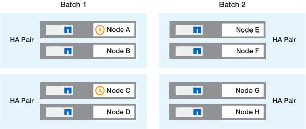

= Métodos de actualización del software ONTAP
:allow-uri-read: 
:icons: font
:imagesdir: ../media/

[role="lead"]
Puede realizar una actualización automatizada del software ONTAP con System Manage. Como alternativa, puede realizar una actualización automatizada o manual con la interfaz de línea de comandos (CLI) de ONTAP. El método que utiliza para actualizar ONTAP depende de la configuración, la versión actual de ONTAP y el número de nodos del clúster. NetApp recomienda usar System Manager para realizar actualizaciones automatizadas a menos que la configuración requiera un enfoque diferente. Por ejemplo, si tiene una configuración de MetroCluster con 4 nodos que ejecuten ONTAP 9,3 o posterior, debería utilizar System Manager para llevar a cabo una actualización automatizada (a veces denominada actualización no disruptiva automatizada o ANDU). Si tiene una configuración de MetroCluster con nodos 8 que ejecutan ONTAP 9,2 o una versión anterior, debe usar la CLI para realizar una actualización manual.

Una actualización puede ejecutarse mediante el proceso de actualización gradual o el proceso de actualización en lote. Ambos elementos no disruptivos.

Para las actualizaciones automatizadas, ONTAP instala automáticamente la imagen ONTAP de destino en cada nodo, valida los componentes del clúster para garantizar que el clúster se pueda actualizar sin interrupciones y, a continuación, ejecuta una actualización en lote o en segundo plano en función del número de nodos. En el caso de las actualizaciones manuales, el administrador confirma manualmente que cada nodo del clúster está listo para la actualización y, a continuación, realiza los pasos necesarios para ejecutar una actualización gradual.

.Actualizaciones graduales de ONTAP
El proceso de actualización gradual es la opción predeterminada para los clústeres con menos de 8 nodos.  En el proceso de actualización gradual, un nodo se desconecta y se actualiza mientras su compañero toma el control de su almacenamiento. Cuando se completa la actualización del nodo, el nodo asociado le devuelve el control al nodo propietario original y el proceso se repite en el nodo asociado. Cada par de alta disponibilidad adicional se actualiza en secuencia hasta que todos los pares de alta disponibilidad ejecutan la versión de destino.

.Actualizaciones en lotes de ONTAP
El proceso de actualización por lotes es el predeterminado para clústeres de 8 nodos o más.  En el proceso de actualización por lotes, el clúster se divide en dos lotes.  Cada lote contiene varios pares de alta disponibilidad. En el primer lote, el primer nodo de cada par de alta disponibilidad se actualiza simultáneamente con el primer nodo de los demás pares de alta disponibilidad del lote.

En el siguiente ejemplo, hay dos pares de alta disponibilidad en cada lote.  Cuando comienza la actualización por lotes, los nodos A y C se actualizan simultáneamente.

Una vez completada la actualización de los primeros nodos de cada par de alta disponibilidad, los nodos asociados del lote 1 se actualizan simultáneamente.

En el siguiente ejemplo, después de actualizar los nodos A y C, los nodos B y D se actualizan simultáneamente.

image::../media/batch_upgrade_set_2_ieops-1619.png[Paso 2 de actualización por lotes]

A continuación, el proceso se repite para los nodos en el lote 2. El primer nodo de cada par de alta disponibilidad se actualiza de forma simultánea con el primer nodo de los demás pares de alta disponibilidad del lote.

En el siguiente ejemplo, el nodo E y el nodo G se actualizan simultáneamente.

Una vez completada la actualización de los primeros nodos de cada par de alta disponibilidad, los nodos asociados del lote 2 se actualizan simultáneamente.

En el siguiente ejemplo, el nodo F y el nodo H se actualizan simultáneamente para completar el proceso de actualización por lotes.

image::../media/batch_upgrade_set_4_ieops-1620.png[Paso 4 de actualización por lotes]

== Métodos de actualización de ONTAP recomendados según la configuración

Los métodos de actualización admitidos por la configuración se enumeran por orden de uso recomendado.

[cols="4"]
|===
| Configuración | Versión de ONTAP | Número de nodos | Método de actualización recomendado 

| Estándar | 9,0 o posterior | 2 o más  a| 
* xref:task_upgrade_andu_sm.html[Automatización no disruptiva gracias a System Manager]
* xref:task_upgrade_andu_cli.html[Automatización no disruptiva gracias a la interfaz de línea de comandos]

| Estándar | 9,0 o posterior | Único | link:../system-admin/single-node-clusters.html["Interrupción automatizada"] 

| MetroCluster | 9,3 o posterior | 8  a| 
* xref:task_upgrade_andu_cli.html[Automatización no disruptiva gracias a la interfaz de línea de comandos]
* xref:task_updating_a_four_or_eight_node_mcc.html[Manual no disruptivo para MetroCluster de 4 o 8 nodos con la CLI]

| MetroCluster | 9,3 o posterior | 2,4  a| 
* xref:task_upgrade_andu_sm.html[Automatización no disruptiva gracias a System Manager]
* xref:task_upgrade_andu_cli.html[Automatización no disruptiva gracias a la interfaz de línea de comandos]

| MetroCluster | 9.2 o anterior | 4, 8 | xref:task_updating_a_four_or_eight_node_mcc.html[Manual no disruptivo para MetroCluster de 4 o 8 nodos con la CLI] 

| MetroCluster | 9.2 o anterior | 2 | xref:task_updating_a_two_node_metrocluster_configuration_in_ontap_9_2_and_earlier.html[Manual no disruptivo para MetroCluster de 2 nodos utilizando la línea de comandos] 
|===
ANDU El uso de System Manager es el método de actualización recomendado para todas las actualizaciones de revisiones, independientemente de la configuración.

NOTE: A. xref:task_updating_an_ontap_cluster_disruptively.html[actualización manual disruptiva] se puede realizar en cualquier configuración.  Sin embargo, no se debe realizar una actualización disruptiva a menos que se pueda desconectar el clúster durante la actualización. Si trabaja en un entorno SAN, debe estar preparado para apagar o suspender todos los clientes SAN antes de realizar una actualización disruptiva. Las actualizaciones disruptivas se realizan mediante la interfaz de línea de comandos de ONTAP.
