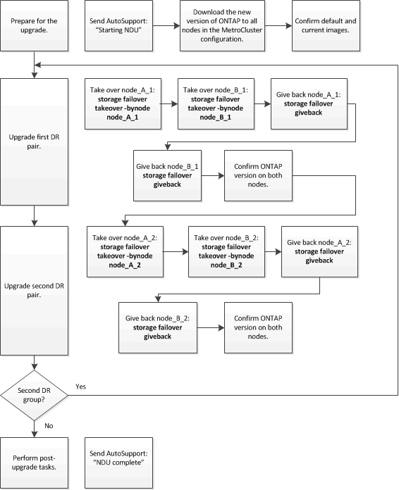

= Actualización manual de ONTAP no disruptiva de una configuración de MetroCluster de cuatro u ocho nodos mediante la CLI
:allow-uri-read: 
:icons: font
:imagesdir: ../media/

[role="lead"]
Una actualización manual de una configuración de MetroCluster de cuatro u ocho nodos implica la preparación de la actualización, la actualización de los pares de recuperación ante desastres en cada uno o dos grupos de recuperación ante desastres simultáneamente y la realización de las tareas posteriores a la actualización.

* Esta tarea se aplica a las siguientes configuraciones:
+
** Configuraciones IP o FC de MetroCluster de cuatro nodos que ejecuten ONTAP 9.2 o una versión anterior
** Configuraciones de MetroCluster FC de ocho nodos, independientemente de la versión de ONTAP

* Si tiene una configuración MetroCluster de dos nodos, no utilice este procedimiento.
* Las siguientes tareas hacen referencia a las versiones anterior y nueva de ONTAP.
+
** Al actualizar, la versión antigua es una versión anterior de ONTAP, con un número de versión inferior al de la nueva versión de ONTAP.
** Al realizar la degradación, la versión anterior es una versión posterior de ONTAP, con un número de versión superior al de la nueva versión de ONTAP.

* En esta tarea se utiliza el siguiente flujo de trabajo de alto nivel:
+

== Diferencias cuando se actualiza el software ONTAP en una configuración de MetroCluster de ocho o cuatro nodos

El proceso de actualización de software MetroCluster varía en función de si haya ocho o cuatro nodos en la configuración de MetroCluster.

Una configuración MetroCluster está compuesta por uno o dos grupos de recuperación ante desastres. Cada grupo de recuperación ante desastres consta de dos parejas de alta disponibilidad, un par de alta disponibilidad en cada clúster MetroCluster. Un MetroCluster de ocho nodos incluye dos grupos de recuperación ante desastres:

image::../media/mcc_dr_groups_8_node.gif[Diagrama de configuración de MetroCluster de ocho nodos.]

Actualiza un grupo de recuperación ante desastres cada vez.

.Para configuraciones MetroCluster de cuatro nodos:
. Actualizar grupo de DR uno:
+
.. Actualice NODE_A_1 y NODE_B_1.
.. Actualice NODE_A_2 y NODE_B_2.

.Para configuraciones MetroCluster de ocho nodos, el procedimiento de actualización del grupo de recuperación ante desastres se realiza dos veces:
. Actualizar grupo de DR uno:
+
.. Actualice NODE_A_1 y NODE_B_1.
.. Actualice NODE_A_2 y NODE_B_2.

. Actualizar grupo DR dos:
+
.. Actualice NODE_A_3 y NODE_B_3.
.. Actualice NODE_A_4 y NODE_B_4.

== Preparar la actualización de un grupo de recuperación ante desastres de MetroCluster

Antes de actualizar el software ONTAP en los nodos, debe identificar las relaciones de recuperación ante desastres entre los nodos, enviar un mensaje de AutoSupport para iniciar una actualización y confirmar la versión de ONTAP que se está ejecutando en cada nodo.

Debe tener link:download-software-image.html["descargado"] y.. link:install-software-manual-upgrade.html["instalado"] las imágenes de software.

Esta tarea debe repetirse en cada grupo de recuperación ante desastres. Si la configuración del MetroCluster consta de ocho nodos, hay dos grupos de recuperación ante desastres. Por lo tanto, esta tarea debe repetirse en cada grupo de recuperación ante desastres.

Los ejemplos que se proporcionan en esta tarea utilizan los nombres que se muestran en la siguiente ilustración para identificar los clústeres y los nodos:

image::../media/mcc_dr_groups_8_node.gif[Diagrama de configuración de MetroCluster de ocho nodos.]

. Identifique las parejas de recuperación ante desastres en la configuración:
+
[source, cli]
----
metrocluster node show -fields dr-partner
----
+
[listing]
----
 cluster_A::> metrocluster node show -fields dr-partner
   (metrocluster node show)
 dr-group-id cluster     node       dr-partner
 ----------- -------     --------   ----------
 1           cluster_A   node_A_1   node_B_1
 1           cluster_A   node_A_2   node_B_2
 1           cluster_B   node_B_1   node_A_1
 1           cluster_B   node_B_2   node_A_2
 4 entries were displayed.

 cluster_A::>
----
. Establezca el nivel de privilegio de admin en Advanced, introduciendo *y* cuando se le solicite continuar:
+
[source, cli]
----
set -privilege advanced
----
+
El aviso avanzado (`*>`) aparece.

. Confirme la versión de ONTAP en cluster_A:
+
[source, cli]
----
system image show
----
+
[listing]
----
 cluster_A::*> system image show
                  Is      Is                Install
 Node     Image   Default Current Version   Date
 -------- ------- ------- ------- -------   -------------------
 node_A_1
          image1  true    true    X.X.X     MM/DD/YYYY TIME
          image2  false   false   Y.Y.Y     MM/DD/YYYY TIME
 node_A_2
          image1  true    true    X.X.X     MM/DD/YYYY TIME
          image2  false   false   Y.Y.Y     MM/DD/YYYY TIME
 4 entries were displayed.

 cluster_A::>
----
. Confirme la versión en cluster_B:
+
[source, cli]
----
system image show
----
+
[listing]
----
 cluster_B::*> system image show
                  Is      Is                 Install
 Node     Image   Default Current Version    Date
 -------- ------- ------- ------- -------    -------------------
 node_B_1
          image1  true    true    X.X.X      MM/DD/YYYY TIME
          image2  false   false   Y.Y.Y      MM/DD/YYYY TIME
 node_B_2
          image1  true    true    X.X.X      MM/DD/YYYY TIME
          image2  false   false   Y.Y.Y      MM/DD/YYYY TIME
 4 entries were displayed.

 cluster_B::>
----
. Active una notificación de AutoSupport:
+
[source, cli]
----
autosupport invoke -node * -type all -message "Starting_NDU"
----
+
Esta notificación de AutoSupport incluye un registro del estado del sistema antes de la actualización. Guarda información útil sobre la solución de problemas si hay un problema con el proceso de actualización.

+
Si su clúster no está configurado para enviar mensajes de AutoSupport, se guardará una copia de la notificación de forma local.

. Para cada nodo del primer conjunto, establezca la imagen del software ONTAP de destino como la imagen predeterminada:
+
[source, cli]
----
system image modify {-node nodename -iscurrent false} -isdefault true
----
+
Este comando utiliza una consulta ampliada para cambiar la imagen de software de destino, que se instala como imagen alternativa, para que sea la imagen predeterminada del nodo.

. Compruebe que la imagen del software ONTAP de destino esté establecida como la imagen predeterminada en cluster_A:
+
[source, cli]
----
system image show
----
+
En el siguiente ejemplo, image2 es la nueva versión de ONTAP y se define como la imagen predeterminada en cada uno de los nodos del primer conjunto:

+
[listing]
----
 cluster_A::*> system image show
                  Is      Is              Install
 Node     Image   Default Current Version Date
 -------- ------- ------- ------- ------- -------------------
 node_A_1
          image1  false   true    X.X.X   MM/DD/YYYY TIME
          image2  true    false   Y.Y.Y   MM/DD/YYYY TIME
 node_A_2
          image1  false   true    X.X.X   MM/DD/YYYY TIME
          image2  true   false   Y.Y.Y   MM/DD/YYYY TIME

 2 entries were displayed.
----
+
.. Compruebe que la imagen del software ONTAP de destino esté establecida como la imagen predeterminada en CLÚSTER_B:
+
[source, cli]
----
system image show
----
+
En el siguiente ejemplo se muestra que la versión de destino está establecida como imagen predeterminada en cada uno de los nodos del primer conjunto:

+
[listing]
----
 cluster_B::*> system image show
                  Is      Is              Install
 Node     Image   Default Current Version Date
 -------- ------- ------- ------- ------- -------------------
 node_A_1
          image1  false   true    X.X.X   MM/DD/YYYY TIME
          image2  true    false   Y.Y.Y   MM/YY/YYYY TIME
 node_A_2
          image1  false   true    X.X.X   MM/DD/YYYY TIME
          image2  true    false   Y.Y.Y   MM/DD/YYYY TIME

 2 entries were displayed.
----

. Determine si los nodos que se van a actualizar actualmente sirven a clientes dos veces para cada nodo:
+
[source, cli]
----
system node run -node target-node -command uptime
----
+
El comando UpTime muestra el número total de operaciones que el nodo ha realizado para clientes NFS, CIFS, FC e iSCSI desde que se inició por última vez el nodo. Para cada protocolo, debe ejecutar el comando dos veces para determinar si el número de operaciones está aumentando. Si aumentan, el nodo actualmente sirve clientes para ese protocolo. Si no aumentan, el nodo no ofrece actualmente clientes para ese protocolo.

+

NOTE: Debe tomar una nota de cada protocolo que ha aumentado las operaciones de cliente de manera que, una vez actualizado el nodo, pueda verificar que el tráfico del cliente se haya reanudado.

+
Este ejemplo muestra un nodo con operaciones NFS, CIFS, FC e iSCSI. Sin embargo, actualmente el nodo sólo ofrece clientes NFS e iSCSI.

+
[listing]
----
 cluster_x::> system node run -node node0 -command uptime
   2:58pm up  7 days, 19:16 800000260 NFS ops, 1017333 CIFS ops, 0 HTTP ops, 40395 FCP ops, 32810 iSCSI ops

 cluster_x::> system node run -node node0 -command uptime
   2:58pm up  7 days, 19:17 800001573 NFS ops, 1017333 CIFS ops, 0 HTTP ops, 40395 FCP ops, 32815 iSCSI ops
----

== Actualizar la primera pareja de recuperación ante desastres en un grupo de recuperación ante desastres de MetroCluster

Debe realizar una toma de control y una devolución de los nodos en el orden correcto para que la nueva versión de ONTAP sea la versión actual del nodo.

Todos los nodos deben ejecutar la versión anterior de ONTAP.

En esta tarea, se actualizan NODE_A_1 y NODE_B_1.

Si ha actualizado el software ONTAP en el primer grupo de recuperación ante desastres y ahora está actualizando el segundo grupo de recuperación ante desastres en una configuración MetroCluster de ocho nodos, en esta tarea debería actualizar NODE_A_3 y NODE_B_3.

. Si el software MetroCluster Tiebreaker está habilitado, esta opción está deshabilitada.
. Para cada nodo del par de alta disponibilidad, deshabilite el retorno automático:
+
[source, cli]
----
storage failover modify -node target-node -auto-giveback false
----
+
Este comando se debe repetir para cada nodo de la pareja de ha.

. Compruebe que la devolución automática está desactivada:
+
[source, cli]
----
storage failover show -fields auto-giveback
----
+
Este ejemplo muestra que se ha deshabilitado la devolución automática de control en ambos nodos:

+
[listing]
----
 cluster_x::> storage failover show -fields auto-giveback
 node     auto-giveback
 -------- -------------
 node_x_1 false
 node_x_2 false
 2 entries were displayed.
----
. Asegúrese de que las I/O no superen el ~50 % en cada controladora y que el uso de CPU no supere el ~50 % por controladora.
. Inicie la toma de control del nodo de destino en cluster_A:
+
No especifique el parámetro -option Immediate porque se requiere una toma de control normal para los nodos que se van a realizar la operación para arrancar en la nueva imagen de software.

+
.. Asumir el control del partner de recuperación ante desastres en cluster_A (nodo_A_1):
+
[source, cli]
----
storage failover takeover -ofnode node_A_1
----
+
El nodo arranca con el estado "esperando la devolución".

+

NOTE: Si AutoSupport está habilitado, se envía un mensaje de AutoSupport que indica que los nodos no tienen quórum de clúster. Puede ignorar esta notificación y continuar con la actualización.

.. Compruebe que la toma de control se ha realizado correctamente:
+
[source, cli]
----
storage failover show
----
+
El siguiente ejemplo muestra que la toma de control se ha realizado correctamente. El nodo_A_1 está en el estado "esperando devolución" y el nodo_A_2 está en el estado "durante toma de control".

+
[listing]
----
 cluster1::> storage failover show
                               Takeover
 Node           Partner        Possible State Description
 -------------- -------------- -------- -------------------------------------
 node_A_1       node_A_2       -        Waiting for giveback (HA mailboxes)
 node_A_2       node_A_1       false    In takeover
 2 entries were displayed.
----

. Asumir el control del partner de recuperación ante desastres en cluster_B (nodo_B_1):
+
No especifique el parámetro -option Immediate porque se requiere una toma de control normal para los nodos que se van a realizar la operación para arrancar en la nueva imagen de software.

+
.. Asuma el control node_B_1:
+
[source, cli]
----
storage failover takeover -ofnode node_B_1
----
+
El nodo arranca con el estado "esperando la devolución".

+

NOTE: Si AutoSupport está habilitado, se envía un mensaje de AutoSupport que indica que los nodos no tienen quórum de clúster. Puede ignorar esta notificación y continuar con la actualización.

.. Compruebe que la toma de control se ha realizado correctamente:
+
[source, cli]
----
storage failover show
----
+
El siguiente ejemplo muestra que la toma de control se ha realizado correctamente. El nodo B_1 está en el estado "esperando devolución" y el nodo B_2 está en el estado "durante toma de control".

+
[listing]
----
 cluster1::> storage failover show
                               Takeover
 Node           Partner        Possible State Description
 -------------- -------------- -------- -------------------------------------
 node_B_1       node_B_2       -        Waiting for giveback (HA mailboxes)
 node_B_2       node_B_1       false    In takeover
 2 entries were displayed.
----

. Espere al menos ocho minutos para asegurarse de las siguientes condiciones:
+
** La multivía del cliente (si está implementada) se estabiliza.
** Los clientes se recuperan de la pausa en la I/o que se produce durante la toma de control.
+
El tiempo de recuperación es específico del cliente y puede tardar más de ocho minutos en función de las características de las aplicaciones cliente.

. Devuelva los agregados a los nodos de destino:
+
Después de actualizar la configuración IP de MetroCluster a ONTAP 9.5 o una versión posterior, los agregados estarán en estado degradado durante un breve periodo de tiempo antes de volver a sincronizar y volver a un estado de reflejo.

+
.. Proporcione los agregados al partner de recuperación ante desastres en cluster_A:
+
[source, cli]
----
storage failover giveback –ofnode node_A_1
----
.. Proporcione los agregados al partner de recuperación ante desastres en cluster_B:
+
[source, cli]
----
storage failover giveback –ofnode node_B_1
----
+
La operación de devolución devuelve primero el agregado raíz al nodo y, después de que el nodo haya terminado de arrancarse, devuelve los agregados que no son raíz.

. Compruebe que todos los agregados se han devuelto emitiendo el siguiente comando en ambos clústeres:
+
[source, cli]
----
storage failover show-giveback
----
+
Si el campo Estado de devolución indica que no hay agregados que devolver, se devolverán todos los agregados. Si se vetó la devolución, el comando muestra el progreso de devolución y qué subsistema vetó la devolución.

. Si no se ha devuelto ningún agregado, realice lo siguiente:
+
.. Revise la solución de veto para determinar si desea abordar la condición "vertical" o anular el veto.
.. Si es necesario, tratar la condición "verto" descrita en el mensaje de error, asegurándose de que las operaciones identificadas se cancelen con gracia.
.. Vuelva a introducir el comando de devolución del nodo de respaldo del almacenamiento.
+
Si ha decidido anular la condición "VETE", establezca el parámetro -override-vetoes en TRUE.

. Espere al menos ocho minutos para asegurarse de las siguientes condiciones:
+
** La multivía del cliente (si está implementada) se estabiliza.
** Los clientes se recuperan de la pausa en la I/o que se produce durante la devolución.
+
El tiempo de recuperación es específico del cliente y puede tardar más de ocho minutos en función de las características de las aplicaciones cliente.

. Establezca el nivel de privilegio de admin en Advanced, introduciendo *y* cuando se le solicite continuar:
+
[source, cli]
----
set -privilege advanced
----
+
El aviso avanzado (`*>`) aparece.

. Confirme la versión en cluster_A:
+
[source, cli]
----
system image show
----
+
En el siguiente ejemplo se muestra que la impresora image2 del sistema debe ser la versión predeterminada y actual en node_A_1:

+
[listing]
----
 cluster_A::*> system image show
                  Is      Is               Install
 Node     Image   Default Current Version  Date
 -------- ------- ------- ------- -------- -------------------
 node_A_1
          image1  false   false    X.X.X   MM/DD/YYYY TIME
          image2  true    true     Y.Y.Y   MM/DD/YYYY TIME
 node_A_2
          image1  false   true     X.X.X   MM/DD/YYYY TIME
          image2  true    false    Y.Y.Y   MM/DD/YYYY TIME
 4 entries were displayed.

 cluster_A::>
----
. Confirme la versión en cluster_B:
+
[source, cli]
----
system image show
----
+
En el siguiente ejemplo se muestra que la imagen 2 del sistema (ONTAP 9.0.0) es la versión predeterminada y actual en node_A_1:

+
[listing]
----
 cluster_A::*> system image show
                  Is      Is               Install
 Node     Image   Default Current Version  Date
 -------- ------- ------- ------- -------- -------------------
 node_B_1
          image1  false   false    X.X.X   MM/DD/YYYY TIME
          image2  true    true     Y.Y.Y   MM/DD/YYYY TIME
 node_B_2
          image1  false   true     X.X.X   MM/DD/YYYY TIME
          image2  true    false    Y.Y.Y   MM/DD/YYYY TIME
 4 entries were displayed.

 cluster_A::>
----

== Actualizar la segunda pareja de recuperación ante desastres en un grupo de recuperación ante desastres de MetroCluster

Debe realizar una toma de control y una devolución del nodo en el orden correcto para que la nueva versión de ONTAP sea la versión actual del nodo.

Debe haber actualizado el primer par DR (node_A_1 y node_B_1).

En esta tarea, se actualizan NODE_A_2 y NODE_B_2.

Si ha actualizado el software ONTAP en el primer grupo de recuperación ante desastres y ahora está actualizando el segundo grupo de recuperación ante desastres en una configuración MetroCluster de ocho nodos, en esta tarea está actualizando NODE_A_4 y NODE_B_4.

. Migre todos los LIF de datos del nodo:
+
[source, cli]
----
network interface migrate-all -node nodenameA
----
. Inicie la toma de control del nodo de destino en cluster_A:
+
No especifique el parámetro -option Immediate porque se requiere una toma de control normal para los nodos que se van a realizar la operación para arrancar en la nueva imagen de software.

+
.. Asuma el control del partner de recuperación ante desastres en cluster_A:
+
[source, cli]
----
storage failover takeover -ofnode node_A_2 -option allow-version-mismatch
----
+

NOTE: La `allow-version-mismatch` Esta opción no es necesaria para las actualizaciones de ONTAP 9.0 a ONTAP 9.1 o para cualquier actualización de parches.

+
El nodo arranca con el estado "esperando la devolución".

+
Si AutoSupport está habilitado, se envía un mensaje de AutoSupport que indica que los nodos no tienen quórum de clúster. Puede ignorar esta notificación y continuar con la actualización.

.. Compruebe que la toma de control se ha realizado correctamente:
+
[source, cli]
----
storage failover show
----
+
El siguiente ejemplo muestra que la toma de control se ha realizado correctamente. El nodo_A_2 está en el estado "esperando devolución" y el nodo_A_1 está en el estado "durante toma de control".

+
[listing]
----
cluster1::> storage failover show
                              Takeover
Node           Partner        Possible State Description
-------------- -------------- -------- -------------------------------------
node_A_1       node_A_2       false    In takeover
node_A_2       node_A_1       -        Waiting for giveback (HA mailboxes)
2 entries were displayed.
----

. Inicie la toma de control del nodo de destino en cluster_B:
+
No especifique el parámetro -option Immediate porque se requiere una toma de control normal para los nodos que se van a realizar la operación para arrancar en la nueva imagen de software.

+
.. Asumir el control del partner de recuperación ante desastres en cluster_B (nodo_B_2):
+
[cols="2*"]
|===
| Si va a actualizar desde... | Introduzca este comando... 

 a| 
ONTAP 9.2 o ONTAP 9.1
 a| 
[source, cli]
----
storage failover takeover -ofnode node_B_2
----

 a| 
ONTAP 9.0 o Data ONTAP 8.3.x
 a| 
[source, cli]
----
storage failover takeover -ofnode node_B_2 -option allow-version-mismatch
----

NOTE: La `allow-version-mismatch` Esta opción no es necesaria para las actualizaciones de ONTAP 9.0 a ONTAP 9.1 o para cualquier actualización de parches.

|===
+
El nodo arranca con el estado "esperando la devolución".

+

NOTE: Si AutoSupport está habilitado, se envía un mensaje de AutoSupport que indica que los nodos están fuera del quórum del clúster. Puede ignorar con toda tranquilidad esta notificación y continuar con la actualización.

.. Compruebe que la toma de control se ha realizado correctamente:
+
[source, cli]
----
storage failover show
----
+
El siguiente ejemplo muestra que la toma de control se ha realizado correctamente. El nodo B_2 está en el estado "esperando devolución" y el nodo B_1 está en el estado "durante toma de control".

+
[listing]
----
cluster1::> storage failover show
                              Takeover
Node           Partner        Possible State Description
-------------- -------------- -------- -------------------------------------
node_B_1       node_B_2       false    In takeover
node_B_2       node_B_1       -        Waiting for giveback (HA mailboxes)
2 entries were displayed.
----

. Espere al menos ocho minutos para asegurarse de las siguientes condiciones:
+
** La multivía del cliente (si está implementada) se estabiliza.
** Los clientes se recuperan de la pausa en la I/o que se produce durante la toma de control.
+
El tiempo de recuperación es específico del cliente y puede tardar más de ocho minutos en función de las características de las aplicaciones cliente.

. Devuelva los agregados a los nodos de destino:
+
Después de actualizar la configuración IP de MetroCluster a ONTAP 9.5, los agregados estarán en estado degradado durante un breve periodo de tiempo antes de volver a sincronizar y a un estado reflejado.

+
.. Proporcione los agregados al partner de recuperación ante desastres en cluster_A:
+
[source, cli]
----
storage failover giveback –ofnode node_A_2
----
.. Proporcione los agregados al partner de recuperación ante desastres en cluster_B:
+
[source, cli]
----
storage failover giveback –ofnode node_B_2
----
+
La operación de devolución devuelve primero el agregado raíz al nodo y, después de que el nodo haya terminado de arrancarse, devuelve los agregados que no son raíz.

. Compruebe que todos los agregados se han devuelto emitiendo el siguiente comando en ambos clústeres:
+
[source, cli]
----
storage failover show-giveback
----
+
Si el campo Estado de devolución indica que no hay agregados que devolver, se devolverán todos los agregados. Si se vetó la devolución, el comando muestra el progreso de devolución y qué subsistema vetó la devolución.

. Si no se ha devuelto ningún agregado, realice lo siguiente:
+
.. Revise la solución de veto para determinar si desea abordar la condición "vertical" o anular el veto.
.. Si es necesario, tratar la condición "verto" descrita en el mensaje de error, asegurándose de que las operaciones identificadas se cancelen con gracia.
.. Vuelva a introducir el comando de devolución del nodo de respaldo del almacenamiento.
+
Si ha decidido anular la condición "VETE", establezca el parámetro -override-vetoes en TRUE.

. Espere al menos ocho minutos para asegurarse de las siguientes condiciones:
+
** La multivía del cliente (si está implementada) se estabiliza.
** Los clientes se recuperan de la pausa en la I/o que se produce durante la devolución.
+
El tiempo de recuperación es específico del cliente y puede tardar más de ocho minutos en función de las características de las aplicaciones cliente.

. Establezca el nivel de privilegio de admin en Advanced, introduciendo *y* cuando se le solicite continuar:
+
[source, cli]
----
set -privilege advanced
----
+
El aviso avanzado (`*>`) aparece.

. Confirme la versión en cluster_A:
+
[source, cli]
----
system image show
----
+
El siguiente ejemplo muestra que la imagen 2 del sistema (imagen ONTAP de destino) es la versión predeterminada y actual en node_A_2:

+
[listing]
----
cluster_B::*> system image show
                 Is      Is                 Install
Node     Image   Default Current Version    Date
-------- ------- ------- ------- ---------- -------------------
node_A_1
         image1  false   false    X.X.X     MM/DD/YYYY TIME
         image2  true    true     Y.Y.Y     MM/DD/YYYY TIME
node_A_2
         image1  false   false    X.X.X     MM/DD/YYYY TIME
         image2  true    true     Y.Y.Y     MM/DD/YYYY TIME
4 entries were displayed.

cluster_A::>
----
. Confirme la versión en cluster_B:
+
[source, cli]
----
system image show
----
+
El siguiente ejemplo muestra que System image2 (imagen ONTAP de destino) es la versión predeterminada y actual en NODE_B_2:

+
[listing]
----
cluster_B::*> system image show
                 Is      Is                 Install
Node     Image   Default Current Version    Date
-------- ------- ------- ------- ---------- -------------------
node_B_1
         image1  false   false    X.X.X     MM/DD/YYYY TIME
         image2  true    true     Y.Y.Y     MM/DD/YYYY TIME
node_B_2
         image1  false   false    X.X.X     MM/DD/YYYY TIME
         image2  true    true     Y.Y.Y     MM/DD/YYYY TIME
4 entries were displayed.

cluster_A::>
----
. Para cada nodo del par de alta disponibilidad, habilite la devolución automática:
+
[source, cli]
----
storage failover modify -node target-node -auto-giveback true
----
+
Este comando se debe repetir para cada nodo de la pareja de ha.

. Compruebe que la devolución automática está activada:
+
[source, cli]
----
storage failover show -fields auto-giveback
----
+
Este ejemplo muestra que se ha habilitado la devolución automática de control en ambos nodos:

+
[listing]
----
cluster_x::> storage failover show -fields auto-giveback
node     auto-giveback
-------- -------------
node_x_1 true
node_x_2 true
2 entries were displayed.
----

