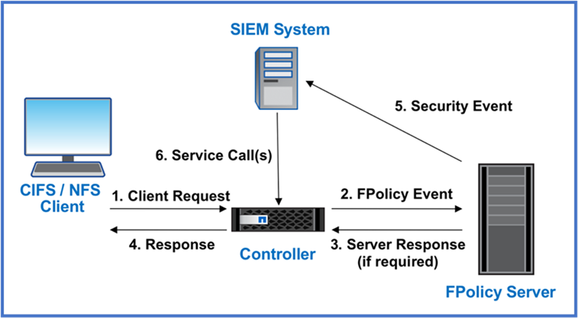

= Diseñe un enfoque de Zero Trust centrado en los datos con ONTAP
:allow-uri-read: 
:icons: font
:imagesdir: ../media/

[role="lead"]
Una red de confianza cero se define por un enfoque centrado en los datos en el que los controles de seguridad deben estar lo más cerca posible de los datos. Las funcionalidades de ONTAP y el ecosistema de partners de FPolicy de NetApp pueden ofrecer los controles necesarios para el modelo de confianza cero centrado en datos.

ONTAP es un software de gestión de datos de alta seguridad de NetApp, y el motor de confianza cero de FPolicy es una funcionalidad de ONTAP líder del sector que proporciona una interfaz de notificaciones de eventos granular basada en archivos. Los partners de FPolicy de NetApp pueden usar esta interfaz para facilitar el acceso a los datos en ONTAP.

image::../media/zero-trust-architecture.png[Diagrama de arquitectura Zero Trust]

== Cree un MCAP centrado en los datos de confianza cero

Para diseñar un MCAP de confianza cero centrado en los datos, siga estos pasos:

. Identifique la ubicación de todos los datos de la organización.
. Clasifique los datos.
. Elimine de forma segura los datos que ya no necesite.
. Comprender qué roles deben tener acceso a las clasificaciones de datos.
. Aplique el principio de privilegio mínimo para aplicar los controles de acceso.
. Use la autenticación multifactor para el acceso administrativo y el acceso a los datos.
. Utilice el cifrado para los datos en reposo y los datos en tránsito.
. Supervisar y registrar todo el acceso.
. Alerte de accesos o comportamientos sospechosos.

=== Identifique la ubicación de todos los datos de la organización

La funcionalidad FPolicy de ONTAP junto con el ecosistema de partners de alianza de NetApp formado por partners de FPolicy le permite identificar dónde existen los datos de su organización y quién tiene acceso a ellos. Esto se hace con el análisis del comportamiento del usuario, que identifica si los patrones de acceso a los datos son válidos. Más detalles sobre el análisis del comportamiento del usuario se discuten en Supervisar y registrar todo el acceso. Si no entiende dónde están sus datos y quién tiene acceso a ellos, el análisis de comportamiento del usuario puede proporcionar una línea base para construir la clasificación y la política a partir de observaciones empíricas.

=== Clasifique los datos

En la terminología del modelo de confianza cero (Zero Trust), la clasificación de los datos implica la identificación de datos tóxicos. Los datos tóxicos son datos confidenciales que no están destinados a ser expuestos fuera de una organización. La revelación de datos tóxicos puede infringir el cumplimiento de normativas y dañar la reputación de una organización. En términos de cumplimiento normativo, los datos tóxicos incluyen los datos del titular de la tarjeta para los https://www.netapp.com/us/media/tr-4401.pdf["Estándar de seguridad de datos del sector de tarjetas de pago (PCI-DSS)"^]datos personales de la UE https://www.netapp.com/us/info/gdpr.aspx["Reglamento general sobre la protección de datos (GDPR)"^]o los datos sanitarios de la https://www.hhs.gov/hipaa/for-professionals/privacy/laws-regulations/index.html["Ley de Portabilidad y Responsabilidad de Seguros Médicos (HIPAA)"^]. Puedes utilizar NetApp https://bluexp.netapp.com/netapp-cloud-data-sense["Clasificación de BlueXP"^] (antes conocido como Cloud Data Sense), un kit de herramientas impulsado por IA, para analizar, categorizar y analizar automáticamente los datos.

=== Deseche de forma segura los datos que ya no necesite

Después de clasificar los datos de su organización, puede descubrir que algunos de sus datos ya no son necesarios o relevantes para la función de su organización. La retención de datos innecesarios es una responsabilidad, y dichos datos deben ser eliminados. Para ver un mecanismo avanzado para borrar datos de forma criptográfica, consulte la descripción de la purga segura en el cifrado de datos en reposo.

=== Comprender qué roles deben tener acceso a las clasificaciones de datos y aplicar el principio de privilegio mínimo para aplicar los controles de acceso

La asignación de acceso a datos confidenciales y la aplicación del principio de privilegio mínimo significa dar a las personas de su organización acceso a solo los datos necesarios para realizar sus trabajos. Este proceso implica el control de acceso basado en roles (https://docs.netapp.com/us-en/ontap/authentication/index.html["RBAC"^]), que se aplica al acceso a los datos y al acceso administrativo.

Con ONTAP, puede utilizarse una máquina virtual de almacenamiento (SVM) para segmentar el acceso a los datos de la organización por parte de los inquilinos dentro de un clúster de ONTAP. Es posible aplicar el control de acceso basado en roles al acceso a los datos, así como al acceso administrativo a la SVM. RBAC también se puede aplicar en el nivel administrativo del clúster.

Además de RBAC, puede utilizar ONTAP link:../multi-admin-verify/index.html["verificación multiadministrativa"] (MAV) para requerir que uno o más administradores aprueben comandos `volume delete` como o `volume snapshot delete`. Una vez que MAV está activado, la modificación o desactivación de MAV requiere la aprobación del administrador de MAV.

Otra forma de proteger las copias snapshot es con ONTAP link:../snaplock/snapshot-lock-concept.html["Bloqueo de copia de snapshot"]. El bloqueo de copia de Snapshot es una función de SnapLock en la que las copias de Snapshot se vuelven indelebles manual o automáticamente con un período de retención en la política de copias de Snapshot para volúmenes. El bloqueo de copia de SnapVault también se conoce como bloqueo de copias de Snapshot a prueba de manipulaciones. El propósito del bloqueo de copias de Snapshot es evitar que los administradores malintencionados o que no sean de confianza eliminen copias de Snapshot en los sistemas ONTAP principales y secundarios. Es posible llevar a cabo una rápida recuperación de copias Snapshot bloqueadas en sistemas principales para restaurar volúmenes dañados por el ransomware.

=== Use la autenticación multifactor para el acceso administrativo y el acceso a los datos

Además del control de acceso basado en roles administrativo del clúster, https://www.netapp.com/us/media/tr-4647.pdf["Autenticación multifactor (MFA)"^] es posible poner en funcionamiento para el acceso administrativo web de ONTAP y para el acceso por línea de comandos de Secure Shell (SSH). La MFA para el acceso administrativo es un requisito para las organizaciones del sector público de EE. UU. O las que deben seguir la PCI-DSS. MFA hace que sea imposible para un atacante comprometer una cuenta usando solo un nombre de usuario y contraseña. La MFA requiere dos o más factores independientes para autenticarse. Un ejemplo de autenticación de dos factores es algo que posee un usuario, como una clave privada, y algo que un usuario conoce, como una contraseña. El acceso web administrativo a ONTAP System Manager o ActiveIQ Unified Manager está habilitado con Security Assertion Markup Language (SAML) 2,0. El acceso a la línea de comandos SSH utiliza autenticación encadenada de dos factores con una clave pública y una contraseña.

Puede controlar el acceso de usuarios y máquinas a través de API con las capacidades de gestión de acceso e identidad en ONTAP:

* Usuario:
+
** *Autenticación y autorización.* Mediante las funcionalidades del protocolo NAS para SMB y NFS.
** *Auditoría.* Syslog de acceso y eventos. Registro de auditorías detallado del protocolo CIFS para probar las políticas de autenticación y autorización. Auditoría granular de FPolicy precisa de acceso NAS detallado a nivel de archivo.

* Dispositivo:
+
** *Autenticación.* Autenticación basada en certificados para el acceso a API.
** *Autorización.* Control de acceso basado en roles (RBAC) predeterminado o personalizado.
** *Auditoría.* Syslog de todas las acciones realizadas.

=== Utilice el cifrado para los datos en reposo y los datos en tránsito

==== Cifrado de los datos en reposo

Cada día se cumplen nuevos requisitos para mitigar los riesgos del sistema de almacenamiento y las deficiencias en la infraestructura cuando una organización reasigna unidades, devuelve unidades defectuosas o actualiza unidades de mayor tamaño vendiéndolas o canjeándolas. Los ingenieros de almacenamiento, como administradores y operadores de datos, deben gestionar y mantener los datos de forma segura a lo largo de su ciclo de vida. https://www.netapp.com/us/media/ds-3898.pdf["NetApp Storage Encryption (NSE), NetApp Volume Encryption (NVE), y NetApp Aggregate Encryption"^] le ayudamos a cifrar todos sus datos en reposo todo el tiempo, sean tóxicos o no, y sin afectar a las operaciones diarias. https://www.netapp.com/us/media/ds-3213-en.pdf["NSE"^] Es una solución de hardware ONTAP link:../encryption-at-rest/index.html["datos en reposo"] que utiliza unidades de autocifrado validadas FIPS 140-2 de nivel 2. https://www.netapp.com/us/media/ds-3899.pdf["NVE y NAE"^] Son una solución de software de ONTAP link:../encryption-at-rest/index.html["datos en reposo"] que hace uso de https://csrc.nist.gov/projects/cryptographic-module-validation-program/certificate/4144["Módulo criptográfico NetApp validado FIPS 140-2 nivel 1"^]la . Con NVE y NAE, pueden utilizarse unidades de disco duro o unidades de estado sólido para el cifrado de datos en reposo. Además, pueden utilizarse unidades NSE para proporcionar una solución de cifrado nativa por capas que ofrezca redundancia de cifrado y seguridad adicional. Si se rompe una capa, la segunda capa aún protege los datos. Estas funcionalidades hacen que ONTAP esté bien posicionado para https://www.netapp.com/us/media/sb-3952.pdf["cifrado preparado para quantum"^].

NVE también proporciona una funcionalidad denominada https://blog.netapp.com/flash-memory-summit-award/["limpieza segura"^] que elimina criptográficamente los datos tóxicos de las fugas de datos cuando los archivos confidenciales se escriben en un volumen no clasificado.

link:../encryption-at-rest/support-storage-encryption-concept.html["Gestión de claves incorporada (OKM)"]El , que es el gestor de claves integrado en ONTAP, o https://mysupport.netapp.com/matrix/imt.jsp?components=69551;&solution=1156&isHWU&src=IMT["aprobada"^] link:../encryption-at-rest/support-storage-encryption-concept.html["gestores de claves externos"] puede usarse con NSE y NVE para almacenar material de claves de forma segura.

image::../media/zero-trust-two-layer-encryption-solution-aff-fas.png[Solución de cifrado de dos capas para diagramas de flujo AFF y FAS]

Como se ve en la figura anterior, se puede combinar el cifrado basado en hardware y software. Esta función permitió https://www.netapp.com/blog/netapp-ontap-CSfC-validation/["Validación de ONTAP en las soluciones comerciales para el programa clasificado de la NSA"^] el almacenamiento de datos confidenciales.

==== Cifrado de datos en tránsito

El cifrado de datos en tiempo real de ONTAP protege el acceso a los datos de usuario y el acceso al plano de control. El acceso a los datos del usuario puede cifrarse mediante el cifrado SMB 3,0 para el acceso a recursos compartidos de Microsoft CIFS o por krb5P para Kerberos 5 NFS. El acceso a los datos del usuario también puede cifrarse con link:../networking/configure_ip_security_@ipsec@_over_wire_encryption.html["IPSec"] para CIFS, NFS e iSCSI. El acceso al plano de control está cifrado con Transport Layer Security (TLS). ONTAP proporciona https://docs.netapp.com/us-en/ontap-cli//security-config-modify.html["FIPS"^] el modo de cumplimiento para el acceso al plano de control, que habilita algoritmos aprobados por FIPS y deshabilita los algoritmos que no están aprobados por FIPS. La replicación de datos está cifrada con link:../peering/enable-cluster-peering-encryption-existing-task.html["cifrado de pares de clústeres"]. Esto proporciona cifrado para las tecnologías ONTAP SnapVault y SnapMirror.

=== Supervisar y registrar todo el acceso

Una vez implementadas las políticas de RBAC, debe implementar supervisión activa, auditoría y alertas. El motor de confianza cero FPolicy de NetApp ONTAP junto con https://www.netapp.com/partners/partner-connect["Ecosistema de partners FPolicy de NetApp"^], proporciona los controles necesarios para el modelo de confianza cero centrado en datos. NetApp ONTAP es un software de gestión de datos de alta seguridad y link:../nas-audit/two-parts-fpolicy-solution-concept.html["FPolicy"] una funcionalidad ONTAP líder del sector que proporciona una interfaz granular de notificaciones de eventos basada en archivos. Los partners de FPolicy de NetApp pueden usar esta interfaz para facilitar el acceso a los datos en ONTAP. La funcionalidad FPolicy de ONTAP, junto con el ecosistema de partners de alianza de NetApp formado por partners de FPolicy, le permite identificar dónde existen los datos de su organización y quién tiene acceso a ellos. Esto se hace con el análisis del comportamiento del usuario, que identifica si los patrones de acceso a los datos son válidos. El análisis de comportamiento del usuario se puede utilizar para alertar de acceso a datos sospechosos o aberrantes que estén fuera del patrón normal y, si es necesario, tomar medidas para denegar el acceso.

Los partners de FPolicy van más allá del análisis de comportamiento del usuario hacia el aprendizaje automático (ML) y la inteligencia artificial (IA) para ofrecer una mayor fidelidad a los eventos y menos falsos positivos, si los hay. Todos los eventos deben registrarse en un servidor de syslog o en un sistema de gestión de información y eventos de seguridad (SIEM) que también pueda emplear ML e AI.

La seguridad de cargas de trabajo de almacenamiento de NetApp (antes conocida https://docs.netapp.com/us-en/cloudinsights/cs_intro.html["Cloud Secure"^]como ) utiliza la interfaz de FPolicy y los análisis de comportamiento del usuario en los sistemas de almacenamiento de ONTAP tanto en el cloud como en las instalaciones para brindarle alertas en tiempo real de comportamiento de usuarios maliciosos. Seguridad de las cargas de trabajo de almacenamiento protege los datos de la organización para que los usuarios malintencionados o en riesgo usen incorrectamente mediante el aprendizaje automático avanzado y la detección de anomalías. Almacenamiento Workload Security puede identificar ataques de ransomware u otros comportamientos malvados, invocar copias snapshot y poner en cuarentena a los usuarios maliciosos. Storage Workload Security también tiene una funcionalidad forense para ver con mayor detalle las actividades de usuarios y entidades. La seguridad de la carga de trabajo de almacenamiento forma parte de NetApp Cloud Insights.

Además de la seguridad de las cargas de trabajo de almacenamiento, ONTAP cuenta con una funcionalidad de detección de ransomware incorporada conocida como link:../anti-ransomware/index.html["Protección autónoma de ransomware"] ARP. ARP utiliza el aprendizaje automático para determinar si una actividad anormal de archivos indica que un ataque de ransomware está en curso y invoca una copia Snapshot y una alerta a los administradores. Seguridad de carga de trabajo de almacenamiento se integra con ONTAP para recibir eventos ARP y ofrece una capa de análisis adicional y respuestas automáticas.
